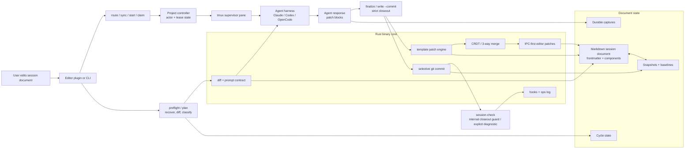

# agent-doc

Interactive document sessions with AI agents.

Edit a markdown file, press a hotkey, and the tool diffs your changes, sends them to an AI agent, and writes the response back into the document. The document is the UI.

> **Alpha Software** — actively developed; APIs and frontmatter format may change between versions.

> **Single-user only.** agent-doc operates on the local filesystem with no access control. Use a private git repository. See the [Security](#security) section for details.

## Install

```sh
curl -fsSL https://raw.githubusercontent.com/btakita/agent-doc/main/install.sh | sh
```

**Alternatives:**

```sh
# From PyPI
pip install agent-doc

# From a local source checkout
cargo install --path src/agent-doc --force

# Or from inside src/agent-doc
cargo install --path . --force
```

The Rust workspace is an implementation detail: every agent-doc Cargo package is
marked `publish = false`. New releases ship through GitHub Releases and PyPI;
older crates.io uploads remain as immutable historical artifacts.

## Quick Start

```sh
# 1. Initialize project (creates .agent-doc/ and installs SKILL.md)
agent-doc init

# 2. Scaffold a session document
agent-doc init session.md "My Topic"

# 3. Claim the document to the current tmux pane
agent-doc claim session.md

# Or provision a distinct pane in this project's current tmux session
agent-doc claim another-session.md --new-pane

# 4. Route hotkey triggers to the correct tmux pane
agent-doc route --dispatch-only --plain-trigger --wait-for-ready 60 session.md

# 5. Run: diff, send to agent, write response back
agent-doc run session.md
```

The typical edit cycle: write in your editor, trigger `agent-doc route --dispatch-only --plain-trigger --wait-for-ready 60 <file>` via a hotkey, and agent-doc dispatches the plain `agent-doc <file>` reopen into the right pane. Route observes Lazily current/typing state before it admits document work, and editor-triggered routing gives slow-starting supervisors a longer readiness window before surfacing a startup error. During that readiness window, route owns the pane input window, so supervisor queue drains and context-reset `/clear` / `/new` recovery wait instead of interleaving into the composer. That editor path always stays a bounded reopen send; it does not restart Codex just because the previous prompt was `/clear`.

## Feature Taxonomy

agent-doc has a broad feature surface because the README doubles as a user guide and capability ledger. The reader-facing overview is grouped by workflow layer here; the exhaustive feature catalog is kept near the bottom so installation, architecture, editor setup, and security stay easy to scan.

- **Document model** — template components, backlog archival, exchange boundaries, snapshots, durable captures, and component-aware baseline guards.
- **Write and merge pipeline** — state-machine intents applied to Lazily current state, typed PID-scoped editor delivery, template patching, exact response replay, strict closeout, and selective git commits.
- **Agent orchestration** — harness-specific routing for Claude, Codex, and OpenCode, prompt contracts, model attribution, direct-run dispatch, sequential/parallel/DAG orchestration, per-item enqueue markers, and lower-agent job packets with target write scopes plus tsift context/graph acceptance sidecars.
- **Session memory** — `agent-doc memory index/search` records backlog, review, done, icebox, and exchange history in `.tsift/memory.db` through the shared `tsift-memory` library for local dedupe and resolved-before checks.
- **Tmux and editor coordination** — route/sync/start/claim, project-controller actor state, session drift repair, startup-miss handling, fast mixed-root exact-visible pane projection, passive sync, stash/rescue, and editor plugins.
- **Operational safety** — preflight recovery, session-check guards, hooks, Codex stop-hook recovery, required-SSH/network capability proofs, accretion context, and explicit manual-repair rules.

## Architecture



The binary owns all deterministic behavior: component parsing, patch application, CRDT merge, snapshot management, git operations, tmux routing, and IPC writes. The bundled skill / AGENTS instructions are the non-deterministic orchestrator layer — they read the diff, generate responses, and decide what to write.

For how concurrent agent writes and live editor keystrokes merge without splicing content across unrelated regions of the document, see [Document Node-Merge Architecture](docs/reference/node-merge-architecture.md).

**Binary vs. Agent Responsibility:**

| Responsibility | Owner | Why |
|---------------|-------|-----|
| Component parsing, patch application, mode resolution | **Binary** (Rust) | Deterministic, testable, consistent across agents |
| CRDT merge, snapshot management, atomic writes | **Binary** (Rust) | Concurrency safety requires flock + atomic rename |
| Diff computation, comment stripping, truncation detection | **Binary** (Rust) | Reproducible baseline comparison |
| Git operations (commit, history, clean) | **Binary** (Rust) | Direct `std::process::Command` calls; selective commit can self-heal narrow missed agent-owned drift and normalize boundary cleanup without absorbing free-form user prompts |
| Tmux routing, session registry, pane management | **Binary** (Rust) | Process-level coordination |
| Pre-response snapshots, undo, extract, transfer | **Binary** (Rust) | File-level atomicity |
| Boundary marker lifecycle (insert, reposition, cleanup) | **Binary** (Rust) | Deterministic, all write paths need it |
| Reading diff, interpreting user intent | **Skill** (SKILL.md) | Requires LLM reasoning, including treating imperative document edits as executable directives rather than meta-only discussion topics |
| Generating response content | **Skill** (SKILL.md) | Non-deterministic |
| Deciding what to write to which component | **Skill** (SKILL.md) | Context-dependent, including the shared Claude/Codex/OpenCode manual-repair rule to use `agent-doc write --commit <file>` when the prompt already exists |
| Enforcing response-cycle completion for the normal happy path | **Binary** (Rust) | `agent-doc finalize` fails closed unless the write reaches a terminal committed cycle state |
| Console progress, final-response timing | **Skill** (SKILL.md) | Partial output stays outside the document |
| Pending item management (parse, populate, process) | **Skill** (SKILL.md) | Semantic understanding of prompts |

See [CLAUDE.md](CLAUDE.md) for the full module layout, stream mode details, and release process.

Large specs now split behind stable entrypoint files instead of growing indefinitely. For command behavior, start at [`specs/07-commands.md`](specs/07-commands.md), which indexes the focused sibling specs for core commands, tmux/session behavior, closeout, and orchestration. For the authoring rule behind that split, see [`runbooks/split-spec-files.md`](runbooks/split-spec-files.md). That runbook applies across agent-doc-managed harness instruction surfaces, while custom root instruction files stay opt-in unless they still match the generated baseline.

## Supported Editors

**JetBrains (IntelliJ, PyCharm, etc.)**

```sh
agent-doc plugin install jetbrains
```

When multiple JetBrains IDE data roots exist, select the target explicitly for automation:

```sh
agent-doc plugin install jetbrains --plugins-dir ~/.local/share/JetBrains/IdeaIC2026.1/plugins
```

Or install from JetBrains Marketplace. Configure an External Tool: Program=`agent-doc`, Args=`run $FilePath$`, Working dir=`$ProjectFileDir$`. Assign a keyboard shortcut.

**VS Code**

```sh
agent-doc plugin install vscode
```

Or install from the VS Code Marketplace. Add a task with `"command": "agent-doc run ${file}"` and bind it to a keybinding.

**Zed**

Install `editors/zed` as a Zed dev extension. It starts the supplemental
`agent-doc zed-lsp` server alongside Zed's normal Markdown support. Only buffers
with valid, non-empty `agent_doc_session` frontmatter enter agent-doc mode;
ordinary Markdown buffers are a strict no-op. See
[`editors/zed/README.md`](editors/zed/README.md).

**Vim/Neovim**

```vim
nnoremap <leader>as :!agent-doc run %<CR>:e<CR>
```

## Domain Ontology

agent-doc extends the [existence kernel vocabulary](https://github.com/btakita/existence-lang) with domain-specific terms.

### Document Lifecycle

| Term | Definition |
|------|-----------|
| **Session** | A persistent conversation between a user and an agent, identified by UUID. Stored in frontmatter as `agent_doc_session`. |
| **Document** | A markdown file that serves as the UI for a session. Contains frontmatter, components, and user/agent content. |
| **Snapshot** | A baseline copy of the document at a known state. Used for diff computation and CRDT merge. |
| **Component** | A named region in a template document (`<!-- agent:name -->...<!-- /agent:name -->`). Targeted by patch blocks. |
| **Boundary** | A marker (`<!-- agent:boundary:hash -->`) that separates committed content from uncommitted user edits. |
| **Exchange** | The shared conversation surface where user and agent write inline. A component with `patch=append`. |

### Pane Lifecycle

| Term | Definition |
|------|-----------|
| **Binding** | The document→pane association stored transactionally in the controller actor store. Created by `claim` (explicit) or `auto_start` (automatic). One active document owns a pane; if a stale cross-document alias exists, the incoming owner closes and clears the displaced binding. |
| **Reconciliation** | The process of matching editor layout to tmux layout. Performed by `sync`. Stashes unwanted panes, provisions missing ones. |
| **Provisioning** | Creating a new tmux pane and starting the configured agent harness for a document. Performed by `route::auto_start`. The normal path for new documents — sync triggers provisioning when it finds a session UUID with no registered pane. |
| **Initialization** | Assigning a session UUID, creating a snapshot, and committing to git. Performed by `ensure_initialized()`. Called from claim, preflight, and sync's resolve_file. |

### Integration Layer

| Term | Definition |
|------|-----------|
| **Route** | Resolve which tmux pane handles a file. Creates panes if needed (provisioning). |
| **Sync** | Reconcile editor layout with tmux layout. The primary entrypoint from the JB plugin on every tab switch. |
| **Claim** | Bind a document to a specific existing pane. Used for manual pane assignment; not needed in normal editor workflow (sync + auto_start handles it). |

### Interaction Model

| Term | Definition |
|------|-----------|
| **Directive** | A signal that authorizes and requests action. User inputs like "do", "go", "yes" are directives. Classified as `DiffType::Approval` in preflight. The directive's brevity is independent of the expected execution thoroughness — quality processes always apply in full. |
| **Cycle** | One round-trip: user edits -> preflight -> agent response -> write-back -> commit. Logged in `.agent-doc/logs/cycles.jsonl` for diagnostics, while the authoritative phase and exact captured response live transactionally in `.agent-doc/state.db`. Recovery projections may be rebuilt from proven ledger state but are never read as hot-path authority. |
| **Layout check** | Pre-agent tmux health inspection (`check_layout()`). Detects: missing window 0, non-idle stash panes, and session drift (registered panes spanning multiple tmux sessions). Preflight immediately attempts the narrow base-index repair when window 0 is missing, then reports remaining issues as `layout_issues[]` in preflight JSON. Full manual sync also repairs window order to `0:agent-doc`, `1:stash`, then overflow `N:stash` before reconciliation. |
| **Session drift** | Condition where registered document panes span more than one tmux session. Detected by preflight's `check_layout()`. Fixed by `agent-doc session set <N>` to consolidate panes into the target session. |
| **Diff** | The user's changes since the last snapshot. Classified by `classify_diff()` into a `DiffType` for skill routing. Comment-stripped before comparison. |
| **Annotation** | A user edit to agent-written content (inline modification, colon-append). Classified as `DiffType::Annotation`. |

## Security

agent-doc is designed for **single-user, local operation**. All session data (documents, snapshots, exchange history) is stored on the local filesystem and committed to a git repository.

**Current security model:**
- **Single user only.** There is no multi-user access control, authentication, or session isolation.
- **Private repo recommended.** Session documents may contain sensitive content (correspondence, research, credentials in context). Use a private git repository.
- **Prompt injection risk.** Content pasted into documents from external sources (emails, web pages, chat logs) could contain prompt injection attempts. The agent processes all document content as user input with no injection scanning.
- **`--dangerously-skip-permissions` exposure.** When running with this flag (common in agent-doc sessions), the agent has full filesystem access. Injected prompts could read files or execute commands if not sandboxed.
- **Shared-doc guard is explicit, not full auth.** Documents may opt into `agent_doc_collaboration: shared`; in that mode, cross-document `extract` / `transfer` and plan-backed `do #id` work that references another `.md` file fail closed unless the document also carries `agent_doc_security_review: <review-id>`. This is an audit marker for cross-document access, not a replacement for real authentication or session isolation.

**Planned:** Collaborative security for web/networked deployments (multi-user access control, session isolation, content scanning, compartmented access patterns).

## Key Features

This catalog is intentionally detailed. It records user-visible capabilities and workflow invariants that are useful for operators, release notes, and implementation audits, but it is no longer part of the first-screen README overview.

- **Template mode** — named component regions (`<!-- agent:name -->`) updated independently; inline attrs (`patch=`, `max_lines=`) > `components.toml` > built-in defaults
- **Completed backlog archive** — reaped tracked work is stored in canonical `agent:done`, or in an explicit repo-relative `.done.md` file via `agent:done archive=...`; `agent-doc migrate` rewrites old `agent:backlog-done` and `agent:pending-done` tags
- **Review-pending tracked work** — `agent:review` holds code-complete `[/]` items awaiting human review. `--pending-gate` moves backlog items into review, `--pending-ungate` moves them back, `--done` accepts review items, and optional `review_done_guard` can warn or fail when a project requires review before done.
- **Session memory retrieval** — `agent-doc memory index/search` stores current backlog/review/done/icebox items and exchange response summaries in `.tsift/memory.db`, enabling deterministic local checks for already-tracked or already-resolved work without embedding tsift's heavy codebase index.
- **CRDT merge** — yrs-based conflict-free merge for concurrent edits between agent writes and user edits; the markdown AST layer also defines a structured `.yrs` overlay schema and node-keyed component mutations so queue/backlog items can be consumed, deduped, reordered, and enqueued by semantic node identity instead of text lines
- **Lazily-first writes** — every edit is a durable named intent applied by compare-and-swap to Lazily current state, then delivered through the registered PID-scoped editor socket. Component patches carry explicit `op`/`node_id` metadata and target-node source proof, so unrelated operator edits survive rebase while cursor position and undo history remain intact.
- **Tmux routing** — persistent per-document agent sessions; `route` dispatches to the correct pane or auto-starts one using the active harness's trigger shape (`/agent-doc` for Claude Code, plain `agent-doc` for Codex); reconciler always runs (no early exits) handling 0/1/2+ panes uniformly
- **Frontmatter harness changes hand off live** — changing `agent:` from Claude to Codex, OpenCode, or back is accepted as a safe-boundary handoff. Route never sends the pending prompt into the old harness; the supervisor preserves any active turn, replaces the child at the next idle boundary, and auto-triggers the document on the new harness. Queue pause holds the handoff until resume without requiring a supervisor restart.
- **Controller-backed admin controls** — `agent-doc admin inspect`, `admin queue pause|resume|drain`, `admin reap`, `admin handoff`, and `admin repair-projection` run through the project controller instead of editing sidecars directly. Document-scoped mutations require the observed actor generation; stale requests produce typed rejected receipts. Queue pause/drain state is stored in `.agent-doc/state.db`, and dispatch reports durable `queue_paused` or `actor_busy_draining` backpressure receipts before any tmux/supervisor input is sent. An accepted `admin queue pause` suppresses the unattended supervisor idle-queue watch auto-injection on a `go`-mode queue (`#qpausego`): the idle-watch stops injecting triggers while the pause is active, and `preflight` surfaces `queue_paused: true`, `queue_pause_reason`, and pause-aware `queue_continuation_guidance`. It does NOT stop the attended in-session `/loop` (which keeps draining real queue work) — use `queue: stop` frontmatter / `--- stop` fences for that; `admin queue resume` clears the pause flag and reason.
- **Route-owned panes close after successful idle cycles** — fresh panes created by `route` run `agent-doc start --route-owned`, so the supervisor stops and reaps the pane after the first new document cycle commits once the supervisor has stable `ready` prompt state or direct pane output shows the harness is back at an idle prompt, and the document has no live backlog, queue, dirty edits, or unresolved exchange-tail prompt. Explicit blocking prompt states still keep the pane alive. If the fresh route never starts a cycle, the startup-miss marker is still recorded, but the just-created idle pane is killed instead of becoming a stranded registered owner.
- **Ready/busy owned panes reconcile instead of stalling forever** — when the actor record, supervisor actor state, and controller lease all say `ready` but a stale Codex renderer cue still reports the pane as `alive-busy`/`prompt_ready=false` from a queued-draft footer, route-owned completion and the idle-queue watch debounce the conflict for the same short window used by stale-busy idle repair, log `owned_pane_ready_busy_conflict`, and let queued work continue. Genuine active turns, permission prompts, shell search, hook-review prompts, help screens, and clean-exit prompts remain protected. `agent-doc session status` prints the conflict and points to bounded reconcile/clear recovery rather than pane restart.
- **Managed reroutes keep one tmux submit boundary** — once a Claude/Codex session is running under `agent-doc start`, route keeps the managed acceptance/queue paths on supervisor IPC, but dispatch-only editor reroutes and file-scoped `/clear` now submit through the live pane's tmux input path instead of mixing direct PTY writes and supervisor-only reopen delivery. Tmux-bound command injects are normalized once and submitted once through the centralized submit profile: Codex, Claude, OpenCode, and default harnesses use normalized text plus a named `Enter` key in one tmux `send-keys -t <pane> <text> Enter` operation. Literal `\r`/`\n` submit bytes are reserved for raw child-PTY fallback writes, not tmux.
- **Queued editor reruns preempt the auto-loop** — a dispatch-only editor rerun queued behind a busy actor in `agent:queue` is inserted **ahead of pending active-loop items** (priority preempt, `#jb-run-preempt-autoloop-priority`): a manual `Run Agent Doc` jumps the queue rather than landing at the tail. Route-owned queue writes are canonical plain `agent:queue` writes: they never add `auto`, and they strip a legacy `auto` attribute from any queue tag they touch. The priority insert lands after any leading queue directive (preset / start fence) and never supersedes a lone active-loop prompt, so the pending item is **preserved** (the manual prompt runs first, then the pending item) instead of being replaced. If an explicit `Run Agent Doc` finds a busy authoritative actor and the document already has an explicitly startable inactive queue head (marker-side `go`/`start`, a start fence, or legacy `auto`), route promotes that head to `queue_active: true` and syncs the snapshot instead of failing as a silent no-op; unattended continuation after closeout still requires `go` mode, never `queue_active: true` alone. Slash-only queue heads such as `/clear`, ignoring surrounding whitespace, are treated as command handoffs for the supervisor rather than assistant prompts, so preflight/plan/run do not open an exchange response cycle for them. A non-interrupting `session clear` on a busy active auto-loop records one deferred queue context-clear projection for the next proven idle boundary; repeated clears before delivery report the existing deferred clear and do not inject another `/clear`.
- **Owned PTY output has a real screen model** — managed supervisors feed filtered child output into an `alacritty_terminal` viewport, and prompt/help/protected-input checks prefer that owned screen state before falling back to the raw byte ring. Cursor rewrites and line clears are interpreted like a terminal instead of tmux scrollback text.
- **Fresh reroutes keep the new pane authoritative** — after route creates a fresh pane for a document, later same-session registry churn cannot hand the reopen back to an older pane and make the new pane disappear from the `agent-doc` window
- **Late associated-pane proof still fails closed before auto-start** — if stale registered-pane cleanup exposes a live legacy associated pane later in the same route pass, the normal route path now stops with explicit inspect/claim guidance instead of silently cold-starting around ambiguous ownership
- **Codex forwarded `Ctrl+C` and EOF/Ctrl-D now always hand control back to the operator** — after a stdin-forwarded `Ctrl+C` that terminates the child, or a forwarded stdin EOF/Ctrl-D, agent-doc returns to an explicit canonical `Enter`/`q` prompt mode so the operator can intentionally restart fresh or exit the supervisor cleanly even when the parent harness keeps stdin in raw-ish mode, including immediately after a successfully committed turn
- **Missing Codex resume sessions recover fresh** — when Codex definitively reports that the requested saved-session ID does not exist, agent-doc removes only that matching `resume` pointer and immediately starts a fresh session. Safe replica-refresh suffix duplication is normalized in the same authority CAS as pointer removal, so malformed binary scaffolding cannot retain the dead ID and repeat the error on later restarts. If the operator already removed the pointer, the running supervisor notices and discards its cached resume arguments too. Ctrl+C also stops the supervisor during crash backoff instead of being swallowed by raw terminal mode
- **Only genuinely promptless clean exits auto-recover** — if a fresh/fresh-restart Codex child clean-exits before it ever surfaces an idle prompt and no operator `Ctrl+D` was forwarded, agent-doc still treats that as failed startup provenance and restarts fresh automatically instead of stopping for the quit prompt
- **Starting actor reroutes promote only dispatch-ready panes** — when the controller still reports the authoritative actor as `starting`, route polls the current actor generation until the live pane shows a harness-specific dispatch-ready prompt, promotes that same actor to `ready`, and then uses the normal managed or dispatch-only send path. If the pane never becomes dispatch-ready, both route modes fail closed before sending tmux or supervisor input and persist one typed diagnostic with elapsed time, pane id, generation, actor state, supervisor health/runtime state, prompt-ready status, and last lifecycle transition. Repeated reroutes for the same stuck pane/generation coalesce behind that saved timeout instead of writing duplicate `route_authoritative_actor_starting_not_ready` records. Because that saved timeout is sticky, a reroute that finds a blocked-by-starting-timeout actor polls that same pane/generation for a dispatch-ready prompt up to the harness recovery budget before failing closed — so a healthy but slow-starting harness (for example a heavy Codex model that takes seconds to present its idle composer after a supervisor restart) recovers within the same reroute instead of dead-ending on a single capture. A busy pane never satisfies that proof, so the bounded poll preserves the promote-only-proven-idle rule; when the proof appears, route clears the saved timeout, promotes the actor to `ready`, and continues through the prompt-gated submit path. If the supervisor refreshes the actor to `closed` or `blocked` during that wait, route stops immediately and reports that terminal state instead of timing out against stale `starting` state.
- **Dispatch-only reroutes keep editor runs on proven live sessions** — after `agent-doc session clear <file>` or when a Codex session lacks a fresh capability-proof log event, the next editor-triggered `agent-doc route --dispatch-only --plain-trigger <file>` still sends the plain `agent-doc <FILE>` reopen through that same live pane's tmux input path when supervisor/runtime state remains healthy. If the authoritative actor's supervisor is unreachable or missing runtime actor state but the actor pane is still the current registered/live owner, dispatch-only keeps that pane as the recovery target, logs `route_dispatch_only_authoritative_degraded_direct_pane`, and only submits after the normal direct-pane readiness checks pass.
- **Dispatch-only reroutes trust shared Enter delivery across harnesses** — if a live Claude Code, Codex, or OpenCode pane accepts `agent-doc route --dispatch-only <file>` through the shared tmux text+`Enter` path but no stronger dispatch-start proof arrives inside the proof window, route completes with `proof=accepted proof_scope=accepted_only` instead of returning a hard IDE failure. Codex hook proof and OpenCode pane-state proof are still logged as stronger `dispatch_start` evidence when available.
- **Direct pane submit telemetry separates input acceptance from dispatch proof** — `route_latency phase=direct_pane_submit` records whether tmux input acceptance was observed, while `route_latency phase=dispatch_start_proof` records harness proof. Empty first captures must stay stable before acceptance so a delayed Codex composer draft can still be seen. If Codex hook tracking later proves the prompt was consumed or submitted, an unobserved direct-pane acceptance is labeled `acceptance_unobserved_dispatch_proven` and uses the tmux/control-mode acceptance budget instead of reporting a false submit timeout. If Codex later has only accepted-without-dispatch-start proof but the same prompt is visibly drafted, route sends one late `Enter` retry and logs `route_submit_late_resubmit`. Before appending a new direct-pane trigger, route also detects the same trigger already drafted in a Codex/Claude composer and sends bounded bare `Enter` retries instead of stacking another copy; stale scrollback is ignored when an idle prompt appears below the trigger.
- **Plain dispatch-only reopens fail closed on a busy actor instead of silently focusing** — an editor `Run Agent Doc` reopen (no prompt-bearing work) against a `busy` authoritative actor focuses the pane but must not return focus-only success, which would report a routed run even though nothing was submitted (`#jb-run-agent-doc-command-route-miss`). Route fails closed with the busy-not-ready diagnostic (`route_dispatch_only_authoritative_actor_busy_focus_only_not_dispatched`) carrying the `the authoritative actor is busy did not return to a dispatch-ready prompt` message, and the JetBrains plugin surfaces that as a "session still running" notification immediately rather than after silently re-waiting the ready timeout once per retry. The narrow exception is an explicitly startable inactive queue head; route may activate it, but unattended continuation after closeout still requires `go` mode. Only a still-booting `starting` pane is silently retried.
- **Dispatch-only proof scope is explicit** — route ops logs include both `proof` and `proof_scope`; Claude Code dispatch-only routes remain `accepted_only`, hook-backed Codex can report consumed/submitted `dispatch_start` proof, and OpenCode can report `proof=pane_state_changed proof_scope=dispatch_start` after its pane leaves idle chrome
- **Claude artifact state is shape-classified, not label-classified** — a completed artifact attached to an idle composer renders as a generic `⧉ <session-owned label>` chip and is skipped while locating the real `❯`/permissions prompt. The active picker remains blocked only by its `Enter to open` plus `claude.ai/code/artifact/...` evidence, so arbitrary artifact names never become routing heuristics.
- **Dispatch-only reroutes now absorb same-file restart handoffs before surfacing a boot-window refusal** — if the first starting-pane ready probe times out but the supervisor immediately restarts the same session in-place or hands it to a new pane for the same file, route follows that newer run instead of pinning the stale pane and surfacing a false `still booting` error to the editor. OpenCode uses a longer harness-specific redraw budget for this startup-window prompt gate so JetBrains reruns do not fail just after the idle splash becomes visible.
- **Dispatch-only reroutes now fail closed on cross-file pane reuse before any rebind lands** — if the candidate pane is still registered to another document, route refuses the reopen instead of transiently superseding that other file's pane and then repairing the registry afterward
- **Optimistic fresh-restart retries stay traceable** — if a routed Codex fresh restart never gets back to a dispatch-ready prompt, agent-doc records a `startup_miss` on the original routed pane with the canonical absolute document path instead of silently redirecting the retry through a replacement pane
- **Stale startup-miss markers clear from the document's current owner** — if a later pane/session is now the registered owner for the same file, `start`, `route`, `sync`, and `session-check` treat the older pane's `startup_miss` marker as stale once the current owner logs a newer `session_start`, even if that handoff rolled the session id
- **Managed Codex capability proof is explicit and fast-path optimized** —
  Codex documents opt in with frontmatter `managed_proof: true`; omitted or
  false keeps the gate `not_required` even when launch args include network,
  SSH, or extra writable roots. Enabled proof children are ephemeral, skip
  project rules, use low reasoning effort, and combine simultaneous network and
  writable-root checks in one `codex exec --json` invocation. OpenCode proof
  selection and the existing contract fingerprints, retry gate, timings, and
  status reporting are unchanged.
- **OpenCode prompt labels stay user-facing** — `agent-doc prompt --all` reports `Permission required` for horizontal OpenCode permission controls when no explicit `← ...` question line is present, so external prompt consumers never display earlier shell command text or ANSI-literal prompt fixtures as the question. First-party JetBrains and VS Code plugins no longer poll this surface.
- **Codex hook-review startup chrome blocks dispatch** — if Codex starts with a `hook needs review` / `Open /hooks to review it` warning, route/start readiness treats that as an operator-action blocker and refuses to inject routed input, even when a later managed capability-proof line says `status=proven`.
- **Required SSH preflight probes no longer touch shared multiplexing state** — when a document declares `required_ssh_targets`, the pre-launch `ssh ... true` capability checks now force isolated probe flags (`ControlMaster=no`, `ControlPath=none`, `ClearAllForwardings=yes`, `PermitLocalCommand=no`) so proving SSH for a managed session cannot create or reuse shared control sockets that might affect later operator shells
- **Required SSH drift detection now covers bare socket EPERM too** — when a document declares `required_ssh_targets`, resumed Codex recovery treats `command_execution` output like `socket: Operation not permitted` as required-SSH capability drift when the same event proves SSH command context for one of those targets; localhost/CDP EPERM remains on the separate browser-capability retry path
- **Resumed required-SSH streams now drop stale prelude text before fresh retry** — when a resumed Codex turn for an SSH-gated document emits assistant prelude text before the failing SSH command, agent-doc buffers those early resumed-session chunks until required SSH is proven safe or the turn completes, so a required-SSH fresh retry can discard the poisoned prelude instead of leaking it into the committed response
- **Passive mixed-root sync stays fail-safe** — when `sync --no-autostart` leaves any visible file blocked, agent-doc preserves the current visible `agent-doc` window layout and warns instead of collapsing the remaining foreign pane set into a new authoritative layout; if the newly focused file is already visible in that preserved window, sync still reselects its pane
- **JetBrains mixed-root editor surfaces have one controller authority** — after the plugin successfully republishes a visible surface through a different Project Controller root, it forgets the prior root so two retained layout projections cannot compete for the same tmux window. On plugin restart it recovers candidate roots from the open markdown set and retires projections retained by the previous plugin process. IntelliJ split restoration waits until every editor window has selected a file before publishing, and component focus uses only the targeted pane-selection lane
- **Manual Sync Tmux Layout uses the doctor repair path first** — full `agent-doc sync` delegates focused session-document repair to `session doctor --repair` logic before reconciling editor panes, so it can close recoverable crash-left commit boundaries where the visible document and snapshot already contain a response that `HEAD` lacks, recreate `0:agent-doc` from a currently selected or explicitly supplied `stash` window, and normalize adjacent `N:stash` overflow; passive `--no-autostart` editor sync keeps that repair step explicit
- **Manual Sync Tmux Layout creates and routes missing panes atomically** — when the requested document has no live pane, the full sync path creates and registers one in the resolved tmux session, waits for its harness composer, and submits the document route before its controller command becomes terminal; JetBrains waits for that outcome and displays pane/start/route failures directly
- **Dispatch-only startup submits are prompt-gated** — editor reroutes no longer type a bare reopen into a startup-window pane until it shows harness-specific idle evidence; a Codex/OpenCode model/context footer is dispatch-ready only when busy cues and protected prompt input are absent. While route owns that pane-input window, it records `RouteSubmitStarted` / `RouteSubmitSettled` / `RouteSubmitBlocked` through the project-controller route projection instead of marker files, so supervisor idle-queue context resets and visible `/clear` / `/new` drafts yield until the submit window settles.
- **Queue context-clear gates are controller projections** — explicit operator clears and queued slash-command clears publish `QueueContextClearStarted` / `QueueContextClearSettled` facts instead of `.agent-doc/context-clear-in-flight` marker files. Busy-loop operator clears publish `QueueContextClearDeferred` instead of `.agent-doc/deferred-clears` marker files until idle-watch can submit the clear and promote the projection to `Started`. Plain manual clear cooldowns use the same context-clear projection source instead of `.agent-doc/queue-cooldowns` marker files. The supervisor idle watch reads the lazily-backed queue projection to avoid stacking another clear or draining an agent-doc trigger into the same composer, and it settles that projection after the cleared pane has been idle for the cooldown window.
- **Queue drain-stall detection uses controller projections** — clean closeouts that still require queue continuation publish `QueueDrainStallContinuationRecorded` through the project controller instead of writing `.agent-doc/drain-stall` marker files. The next preflight reconciles and clears that lazily-backed projection, while supervisor-driven drain progress clears it before it can false-fire `queue_stall_detected`.
- **Preflight observes the live document model before surfacing editor-authority failures** — when a live editor owns a document but the CRDT relay model is absent or not converged, current-document resolution observes the retained Lazily projection and live relay until they reach a fixed point. It emits no editor republish or re-registration request. A bounded failure is reported as document-model startup/reconciliation guidance while disk remains non-authoritative.
- **Controller restarts repair editor replicas even when transport stays up** — the controller sends one targeted rebuild signal for every stranded registration, including peer-pull-capable JetBrains editors whose reconnect hook may not run after a transparent restart. The idle watcher adds one bounded missing-replica observation before its 30-second backoff, while high-frequency liveness reconciliation no longer floods `ops.log`.
- **Editor document switches focus immediately, then reconcile in the background** — automatic editor sync first submits a latest-wins Project Controller focus command without waiting on debounce, sync-lock acquisition, prune cleanup, or tmux-router reconciliation; a real selection event still runs the guarded `sync --no-autostart --exact-visible` pass afterward so the selected tab can replace the old pane on that editor side
- **Controller-local actor proof keeps passive tab sync live** — the controller-owned exact-visible sync reads its authoritative SQLite actor row locally and swaps an already-running hidden pane into view; standalone passive sync still avoids a nested Project Controller actor-binding RPC
- **Exact visible editor snapshots do not resurrect stale siblings** — automatic editor syncs pass `--exact-visible` with `--no-autostart` when they have the full visible markdown projection, so a one-file editor state remains a one-pane tmux projection instead of expanding from remembered column memory
- **Passive editor sync skips stash scans before reconcile** — `sync --no-autostart` still prunes stale registry rows and retained dead non-stash panes, but it skips stash-window and stash-pane cleanup so tmux-router can detach extra visible panes immediately after a document switch instead of waiting on orphaned stash scans
- **Passive sync proceeds around open closeouts** — when `sync --no-autostart` needs to attach a newly requested pane while an already-visible unwanted pane owns an open `preflight_started` / `response_captured` / `write_applied` cycle, agent-doc keeps that closeout pane alive but still allows DETACH to stash it, so the requested document can attach/focus without temporary visible pane growth
- **Editor sync lock contention is bounded and self-healing** — if an older sync process is stuck or orphaned, later selection/layout sync commands wait only for the contention budget. Safe-passive sync may already have applied the pre-lock pane handoff, then logs the retry marker and returns without further auto-start, tmux reconciliation, or post-lock hidden-pane focus changes; editor plugins treat that marker as deferred and retry only the newest superseding selection instead of marking stale state applied. If the contended lock is held by stale orphaned `agent-doc sync` processes, sync reaps those lock owners and retries acquisition so autosync/manual layout sync can recover without operator cleanup
- **Open closeout panes stay alive during sync reconcile** — if an unwanted pane still owns a document with an open `preflight_started`, `response_captured`, or `write_applied` cycle, sync logs that state but lets tmux-router stash the pane; stashing is non-destructive, so closeout can continue without forcing a third visible pane into a two-document editor projection
- **Closeout drift noise is narrower** — session-check no longer treats plain content-edit drift as an unstarted response cycle, and `content_ours` prompt-prefix fallback preserves unprefixed agent response lines already committed in `HEAD` instead of creating a follow-up normalize commit
- **Sync now refuses editor-provided non-`agent-doc` tmux windows** — if the editor passes a tmux window target that is not actually an `agent-doc` window and the target session has no discoverable `agent-doc` window by name, sync fails closed and preserves layout instead of reconciling remembered docs onto the wrong window
- **Current tmux session resolution is pane-owned** — route, sync, preflight, and parallel dispatch resolve the current session from `TMUX_PANE` when available, so another attached client's selected session cannot pull the active agent-doc window into the wrong tmux session
- **Normal route/start/sync never re-elect owners from pane heuristics** — the normal path asks the project controller for the authoritative actor binding. Session-log owners, historical rebind events, and generic same-file process-tree matches remain repair diagnostics, not owner-election inputs.
- **Project controller IPC is bounded against stalled clients** — controller clients time out instead of blocking forever waiting for a response, the server handles accepted clients independently so one idle socket cannot monopolize `.agent-doc/controller.sock`, and readiness checks release their socket before issuing follow-up RPCs.
- **Supervisor lifecycle reports now go through the project controller** — `agent-doc start` lazy-launches the project controller, records the starting actor generation and supervisor lease, and reports prompt-ready, busy dispatch, waiting-input, blocked, and closed transitions through controller IPC with stale session/pane/generation rejection. A newer register/heartbeat from the same supervisor lease can replace a `Closed` actor for the same pane, which lets a reopened Codex/OpenCode child in the same route-owned supervisor become authoritative immediately instead of replaying the closed session. `session status` / `doctor` also refresh the controller lease heartbeat from a live supervisor only when the IPC state proves the same actor session, pane, and generation. `session status <FILE>` additionally prints direct live-pane evidence (`alive-idle`, `alive-busy`, `closed-clean`, or `projection-stale`) from tmux current-command and recent output so projected controller state cannot hide a still-running pane; when direct evidence is idle but projections remain busy, status/clear reconcile the actor and controller lease back to ready. File-scoped restart refuses `alive-busy` panes. Every turn stage independently detects a proven-stale supervisor and writes the same idempotent, CRDT-checkpointed recycle request; the controller waits for a safe idle boundary before replacing the process, and no stale marker is inserted into the document. This integrity recovery applies even when proactive recycle polling is opted out. File-scoped clear is an explicit operator action: it does not refuse solely because `pane_current_command` is `agent-doc`, but it still refuses protected prompt input and explicit busy cues such as an active Codex turn, hook-review prompt, or help screen. `session interrupt-clear <FILE>` is the explicit discard path that interrupts the owning pane, waits for idle/closed evidence, then retries clear. Interrupt-clear timeouts include the final blocking state, evidence source, prompt-ready value, current command, and recent pane tail in both ops logs and user-facing errors.
- **Supervisor recycle gates are controller projections** — route/direct/dispatch-only callers no longer poll recycle-in-flight marker files before injecting work. Recycle starts and settles are recorded as lazily-backed `SupervisorRecycleStarted` / `SupervisorRecycleSettled` facts in the project controller; prompt injection waits on the controller projection so a trigger cannot disappear during supervisor `execve`. Self-driving loop yield for `stale_binary_drain` and `state_flush_drain` uses the same projection, so preflight/session-check/queue continuation report `queue_recycle_yield=true` while the supervisor is recycling and then continue once the projection settles.
- **Native upgrades use an explicit safe-adapter policy** — `agent-doc lib-install` (and `make install`) sends `reload_library` through PID-scoped endpoints only to adapters explicitly known to support safe hot reload. VS Code reloads and re-registers its open replicas. On Linux, JetBrains marshals JNA invocations onto a bounded generation-owned worker pool; document replicas retain FIFO ordering through per-document Kotlin workers and per-replica Rust locks, so one large document cannot head-of-line block every other replica. A queued call timeout cancels only that call, while a native invocation that actually runs beyond its lease still poisons the generation. Reload stops and joins CRDT/listener workers, drains calls, quiesces native replicas, terminates all owner threads so Rust TLS destructors run, closes the JNA handle, and proves the old `/proc/self/maps` entry is gone before loading and publishing the replacement shadow. Controller launch from the cdylib goes through a short-lived external helper, so no controller-lifetime child-reaper thread can pin the mapping. Durable reliable-sync SQLite outboxes live only in the project controller; the reloadable cdylib is a thin RPC client and retains no `state.db` connection. Any failed drain/unmap/ABI proof fails closed without loading a second generation; unsupported hosts and unknown adapters remain restart-required. JetBrains Kotlin package upgrades still declare `require-restart="true"` because native-library reload does not replace plugin classes. No broadcast file or watcher exists. `agent-doc admin reload-lib` repeats the policy-aware fan-out and reports projects, endpoints, deliveries, restart requirements, and failures.
- **Controller upgrades recycle safely mid-turn; supervisors preserve the live child** (`#recycle-no-boundaries`, `#midturn-controller-recycle`) — `agent-doc admin recycle <FILE>` and install fan-out immediately start a private replacement even while durable harness dispatches or controller RPCs remain open. After the replacement hydrates, socket promotion redirects new RPCs; the predecessor drains already-accepted RPCs before retiring. The route-owned supervisor owns the Claude/Codex/OpenCode child, so the turn and pane continue untouched. Routine supervisor image replacement remains turn-boundary/checkpoint gated because that is the process capable of affecting pane continuity. `--force` only skips the controller debounce; when no live controller answers and the command escalates through `session restart-supervisor`, it additionally permits interrupting a busy pane. A non-stable handoff remains the strict replacement gate. A bare project-root / `--project-root` form with no live controller has no document to cold-start and still prints a one-step remedy. `--json` adds `forced` (and `escalated_cold_start` on the single-project arm).
- **Route re-checks associated-pane evidence immediately before cold-start** — stale registered-pane cleanup does not relax the ownership guard. If a legacy associated pane becomes provable only after the earlier recovery branches run, route still fails closed instead of treating auto-start as a safe tie-breaker.
- **Passive sync now fails closed on legacy associated panes instead of reclaiming them implicitly** — when `sync --no-autostart` sees only session-log/process-tree/`registry_rebind` evidence for a pane, it blocks that file and requires an explicit claim/repair instead of silently re-registering the pane or cold-starting around ambiguous ownership.
- **Route readiness is binary-owned** — prompt detection / trigger acceptance lives in `route.rs`, must tolerate shell startup noise, and keys off the actual harness prompt shapes rather than generic shell `>` echoes; the skill should not try to infer pane readiness from echoed command text
- **Route progress logging is UTF-8 safe** — live reroute diagnostics trim captured tmux lines on char boundaries, so Unicode prompt/status glyphs such as `…` or `·` cannot panic the binary while route is waiting for readiness
- **Harness-specific arg aliases** — `agent_args` is the generic override; `claude_args`, `codex_args`, and `opencode_args` are harness-specific aliases used only by their matching backends; submodule-hosted Claude/Codex documents also auto-add the superproject working tree plus any external git metadata directories they need (`.git/modules/...` plus the superproject `.git`) so workspace-write sessions can patch parent-repo docs and still complete the normal git lifecycle
- **Streaming** — recovery-only partial checkpoints followed by one final CRDT write (`agent-doc stream`), with optional chain-of-thought routing
- **Task orchestration** — `agent-doc orchestrate --mode sequential|parallel|dag` gives one surface for stepwise fresh-agent execution, worktree fan-out, and dependency-aware DAG scheduling; sequential injects each prompt into `exchange`, buffers backend streaming outside the document, and publishes one complete response through strict `finalize` (including its binary-owned session check) without spawning a redundant companion command; parallel preserves the existing worktree backend, DAG mode honors dependencies in deterministic topological order, and `--mode dag --from-queue` persists an auto-DAG schedule plus schedule-backed job packets for active queue batches
- **Auto-DAG queue scheduling** — active `agent:queue` batches can be expanded into `agent-doc-auto-dag-schedule-v1` nodes with dependency batches, node state, attempt counts, replay/repair commands, tsift graph/ownership gates, and ops-log guard decisions before child work launches; `--resume-schedule <ID>` resumes the durable schedule without relaunching complete or failed/gated nodes
- **tsift graph-backed planning** — when a materialized `.tsift/graph.db` works, `plan` and `orchestrate` attach `graph-db evidence` handles plus `conflict-matrix` ownership summaries to queued `do #id` work and pass bounded `<tsift_graph_evidence>` context to child/job prompts without writing that context into the session document; if tsift is stale, unavailable, times out, or violates the graph contract, agent-doc warns and continues without graph evidence/manual packets instead of failing the whole turn
- **Editor plugins** — JetBrains and VS Code plugins for hotkey integration and IPC writes
- **Watch daemon** — auto-submit on file change with debounce and reactive mode for stream documents; watched markdown sessions also emit node-keyed `document_node_events` batches for AST insert/remove/replace/move/strike/unstrike changes
- **Linked resources** — `links` frontmatter field for local files and URLs; URL content fetched, converted HTML→markdown via `htmd`, cached, and diffed on each preflight
- **Session logging** — persistent logs at `.agent-doc/logs/<session-uuid>.log` for debugging session crashes and restarts
- **Preflight gate** — `agent-doc preflight` auto-recovers open `response_captured` / `write_applied` cycles, treats `staged snapshot already matches HEAD` as an already-committed no-op closeout instead of `commit_failed`, repairs stale `preflight_started` locks when the recorded snapshot/file hashes still match exactly, otherwise still requires a real pending/capture replay before auto-closing `preflight_started`, fails closed when an empty `preflight_started` cycle has unresolved prompt-bearing drift and no response capture to replay, fails closed on unrecoverable `preflight_started` drift instead of snapshot-committing over newer live content, also fails closed on hidden uncommitted closeout drift (`snapshot != HEAD` / visible bypassed `### Re:` with no recoverable cycle) before diffing, preserves ordinary post-exchange HTML comments as user scratch content, does not auto-compact exchanges during preflight, emits `warnings[]` such as `harness_mismatch` when frontmatter `agent:` differs from the detected active harness and `stale_install` when installed/built `agent-doc` artifacts predate the latest source commit (`#install-stale-guard`, dogfood/dev only), and emits `effective_tier`, `required_tier`, `suggested_tier`, `model_switch(_tier)`, `agent_model`, plus bounded `session_accretion` warnings when exchange/log heuristics show churn-heavy growth
- **Bounded recent-context packs** — when resumed prompt targets land in a warn/block accretion session, `run` / `stream` / `orchestrate` keep the full document on disk but replace the full exchange tail in the agent prompt with a bounded pack containing prompt targets, session summary, backlog head, a lightweight live+archive response TOC, and the `### Re:` turns anchored to those prompt positions in `exchange` (the enclosing response for inline edits, or the immediately previous response for tail prompts), plus a reminder to ask for older turns or use `agent-doc response-fetch` when no clean anchor exists or more neighboring history is required
- **Accretion advisory** — `session_accretion` still summarizes exchange growth, closeout churn, and restart-heavy reopen signals so prompts can choose bounded recent-context packs or suggest compaction/restart when useful. These signals remain advisory: `agent-doc plan` must not turn exchange-size accretion or repeated no-op closeout churn into a `compact` handoff unless the prompt or document explicitly requests compaction. Claude skill auto-update uses restart by default; `/compact` reload is allowed only with explicit `agent_doc_auto_compact` frontmatter or project `.agent-doc/config.toml` opt-in. A Codex skill-version mismatch installs without a reload request, re-reads the installed skill completely, and continues the active turn in place (`#codex-skill-reload-in-place`).
- **Durable response capture** — every final response is persisted in the `state.db` state-machine ledger before canonical application, so interrupted cycles resume the same intent instead of regenerating it. Streaming may emit cold recovery checkpoints, but those projections never become normal read authority.
- **Backbone closeout facts** — accepted cycle-state transitions append typed Lazily state-backbone facts (`PreflightStarted`, `ResponseCaptured`, `WriteApplied`, `CommitObserved`, `CycleAbandoned`) using stable event ids. Lifecycle re-entry, `session-check`, and preflight read the `state.db` projection exclusively; there is no JSON cycle-state compatibility authority.
- **Git-owned commit proof** — real commits and already-current no-op closeouts append an exact `HEAD` SHA `CommitObserved` fact into the closeout projection, superseding the cycle-state bridge's compatibility content-hash observation when git proof is available
- **Bidirectional transport proof** — maintained editor plugins publish lazily transport receipt facts (`EditorPatchApplied` / `EditorPatchRejected`) alongside binary write intent / expected response hash and visible-buffer hash facts; ACK-only plugins are incompatible and closeout reads the lazily projection instead of treating whole-buffer sidecars as snapshot authority
- **Template exchange guard** — template writes fail closed when prompt/response content escapes either below `<!-- /agent:exchange -->` or into the gap before later agent components such as backlog; explicit repair/compaction still normalize the safe escaped-conversation shapes, while comment-only notes without escaped conversation headings stay outside and ambiguous mixed structure is rejected
- **Boundary singleton guard** — outside fenced examples, a session document may contain exactly one `agent:boundary` marker and it must occupy its own tail line; ordinary write/finalize paths reject inline or duplicate markers before mutation, while explicit legacy repair collapses them after preserving complete exchanges
- **IPC timeout ordering guard** — timeout fallbacks and `repair` now normalize stale-boundary response placement so multi-paragraph prompt text stays before the assistant response and the boundary closes the completed turn; if that order cannot be proven, closeout fails closed instead of committing a split prompt
- **Backlog prompt cleanup** — when a template/CRDT closeout answers prompt-target text typed directly inside `agent:backlog` / legacy `agent:pending`, the write path removes those resolved raw prompt lines after merging the exchange response while preserving ordinary backlog edits and pending state changes
- **Cross-document backlog capture** — prompt presets or user instructions that name another backlog file must close through `--pending-add-to <target-file> "<item>"`, so the item is added to the named document instead of the current session. The write path fails closed when the target is missing or lacks an `agent:backlog` / `agent:pending` component.
- **Respect manual cleanup** — if a user deletes that escaped conversation tail by hand in a template doc, `agent-doc repair` now discards the stale captured response and advances the snapshot to the repaired file instead of failing on a capture-baseline mismatch or reapplying the removed tail
- **`repair` closes git-backed recovery immediately** — direct `agent-doc repair` (legacy alias: `recover`) now runs the normal commit boundary after replaying or deduping a pending response in git, instead of leaving repaired assistant content uncommitted until a later `preflight`
- **Hard response commit boundary** — every appended response should cross a commit boundary unless the operator explicitly wants it left open; the normal happy path is `agent-doc finalize <file>`, while missed-patchback repair uses `agent-doc write --commit <file>`
- **Explicit no-followup closeout** — pass `--no-followups` (alias `--no-pending-capture`) on the first `finalize` attempt when the response intentionally creates no actionable follow-up work. The runtime records that intent as transient pending-capture evidence for retry/pre-commit checks and removes it from the visible and committed document; agents do not need to search for or inject the internal guard marker.
- **Manual repo commit ordering keeps the session doc on the finalize path** — when an `agent-doc` turn includes ordinary repo `commit + push`, manual git commits should stage only the intended non-session repo files, stop immediately on any stage failure, verify the staged diff still matches that intended path set, and commit only that validated set. The session document itself still closes through `agent-doc finalize <file>` or `agent-doc write --commit <file>`, and the push happens after that closeout commit lands so the response commit is included
- **Harness-native entrypoints are binary-owned workflow starts** — `/agent-doc <file>` in Claude Code, `agent-doc <file>` in Codex/OpenCode/direct-exec, and equivalent harness-native entry forms must be treated as the start of the binary-managed response cycle, not as permission to patch the document manually and later say "not committed"
- **Session-document `write --commit` is strict** — when `write --commit` is used to patch back a response into a real session document (`agent_doc_session` / legacy `session`), it now requires git before mutation and only succeeds once the cycle reaches `committed`; best-effort `--commit` remains only for non-session docs and `--pending-only` maintenance
- **Mode-aware bare/run entrypoint** — `agent-doc <file>` and `agent-doc run <file>` now share the same document-mode-aware path: template docs use template patchback, append docs use inline blocks, and missing format defaults to template
- **Direct run dispatch is bounded and foreground-safe** — after `run` opens its fresh `preflight_started` cycle, the agent child has a bounded wait (`AGENT_DOC_RUN_AGENT_TIMEOUT_SECS`, default 1800s). Timeout or recursive Codex-in-owning-pane invocation records a recoverable `preflight_started` timeout event with cycle/pane/actor diagnostics instead of leaving the CLI silent after `Submitting to codex...`. When `run` is invoked with terminal stderr inside a tmux pane owned by a Codex/OpenCode parent harness, routine run/diff/commit stderr is redirected to `.agent-doc/logs/run-stderr.log` unless verbose input diagnostics are enabled, so progress output cannot paint over the foreground TUI after a restart
- **Owner-pane self-invocation preserves the unresolved prompt (`#codex-owned-pane-prompt-miss`)** — when a Codex-owned pane re-invokes `agent-doc <file>` for the document it already owns and an unresolved exchange prompt is still pending, `run` now fails closed *before* pre-commit and before opening a cycle. The diagnostic names the unresolved prompt and the in-pane recovery path (answer it in this owner pane's turn, then persist with `agent-doc finalize` / `write --commit`) and tells the operator not to re-run the same direct command from the same pane. Because the early guard bails before pre-commit, the prompt stays uncommitted and executable instead of being baselined into `HEAD` by the older late recursive-deadlock guard (which still abandons the empty cycle for the no-prompt / queue-only case). `session-check` is the backstop: an abandoned `recursive_direct_invocation_blocked` cycle with an unresolved exchange prompt still remaining is reported as a missed-prompt recovery, not accepted as terminal closeout
- **Direct run never dispatches an already-committed repair diff** — if pre-commit repair proves the only diff was an already-committed missed patchback and no new response body exists, `run` rechecks the diff, stops before invoking the child agent, and points the operator to `agent-doc write --commit <file>`
- **Run closeout is durable before commit** — once `run` has written the final response (and any `resume` update), it records `write_applied` before the post-write commit so interrupted runs can be finished deterministically by `preflight`; git-backed `run` now shares the same strict post-write closeout helper as `finalize`, `write --commit`, `repair`, and the Codex Stop-hook, so success also requires the snapshot/`HEAD` proof plus `session-check`
- **Binary-owned finalize path** — `agent-doc finalize <file>` is the strict happy-path response command: it reuses the normal write pipeline but requires the document to live in git and fails unless the cycle reaches a terminal committed state
- **FlowCore closeout diagnostics** — strict pre-write/pre-commit guard blocks, document-mutation patchback parse outcomes, repair recovery boundaries, committed-cycle late fallback rejection, and commit completion now emit typed `flow_event` records so `agent-doc ops summary` can group closeout failures by stage instead of relying on ad hoc proof strings
- **Ops bug clusters** — `agent-doc ops summary` ranks closeout/captured-response drift, route/start replay gaps, Codex manifest warning storms, SQLite correlation counts, cross-harness markers, session-review guardrails, and working-tree drift with example lines plus file/session/cycle/thread correlation keys
- **Direct-exec post-write guard** — the direct-exec Codex and OpenCode instruction path runs `agent-doc session-check <file>` after `finalize` or manual `write --commit`, and a nonzero check blocks success reporting until recovery finishes; it flags likely direct response patchbacks (`### Re:` / `## Assistant`) that bypassed `agent-doc`, names tracked side-effect files plus the exact `agent-doc write --commit <FILE>` repair path when the closeout is still only in the working tree, fails closed when committed-cycle exchange drift appends a prompt+response pair or other response content, fails closed when prompt-bearing user edits exist with no newer cycle start or when the live exchange tail is still prompt-only with no assistant response, and still self-heals already-committed historical response drift when `HEAD` proves the response is no longer out-of-band, including committed prompt+response pairs that precede newer local drift as long as that later drift did not add another assistant patchback
- **Managed closeout is turn-reactive (`#sessioncheckturnreactive`)** — connected clients consume the successful `agent_doc_finalize` result as the terminal closeout report, including any next queue continuation, and do not invoke a second `agent_doc_session_check`. Managed orchestration likewise stops at strict `finalize`. The next turn's admit/preflight resolves the current document and applies the same open-cycle, prompt-only-tail, and bypassed-patchback guards before opening work. Opening a newer cycle clears the older cycle's closeout owner immediately, so an outstanding diagnostic for turn N is superseded by turn N+1 instead of holding a lease until a clock expires. The explicit session-check command remains for direct-exec distrust checks and operator debugging.
- **Closeout followers observe lease expiry without polling** — a follower still wakes immediately on terminal-cycle and explicit owner-release facts, and now schedules the incumbent lease boundary as well. The timer only publishes that clock edge into a keyed controller-owned Lazily source; the shared Computed closeout gate decides whether the owner remains blocking. That eventless stopgap can no longer turn a short retained recovery into a full 30-second wait followed by another manual status retry.
- **Codex empty cursor is not an operator draft** — dispatch-only reroutes recognize Codex's exact idle `› |` composer rendering as empty and may submit into it, while populated composer text remains protected.
- **No hot-path sidecar authority** — cycle, capture, queue deletion, continuation, turn scope, editor operation capture, transport health, and controller cooldown state are transactional `state.db` facts. Snapshot/CRDT files are recovery projections only and cannot override Lazily current state or the ledger.
- **Codex Stop-hook and repair replay guard** — `agent-doc skill install` for Codex now also writes `.codex/hooks.json`, enables `features.hooks = true`, and sets `[mcp_servers.agent-doc] default_tools_approval_mode = "approve"`, so agent-doc MCP calls do not repeatedly pause active Codex turns after local reinstall and `UserPromptSubmit` tracks the active document even when the submitted prompt body includes injected AGENTS/instruction preambles ahead of the real `agent-doc <FILE>` line. `Stop` first tries to finish the response cycle deterministically from `last_assistant_message` only when that payload validates as a single assistant closeout; tracked state survives nested `.agent-doc` root / CWD drift and later-stop turn drift within the same Codex session, while transcript-shaped or full-document payloads are kept as diagnostics and blocked instead of being replayed. Guard comments such as `<!-- no-pending-capture -->` may wrap an otherwise valid patch response, and plain progress commentary before the first patch is stripped before replay. Direct template writes use the same guard when unmatched text surrounds an exchange patch, so progress prose is not appended into `agent:exchange`. If `last_assistant_message` is empty because Codex stopped after a tool-only/authentication step such as an MCP OAuth / `authenticate` flow, the hook still fails closed, saves a diagnostic record with the tracked prompt, and forces the turn back through the normal `finalize` / `session-check` recovery boundary. The same replay-shape guard now fails closed inside `agent-doc repair`, writing blocked payload diagnostics under `.agent-doc/repair-blocked/` rather than appending a full exchange dump back into `agent:exchange`.
- **`skill-harness` integration is downstream-owned** — `agent-doc-skill-harness` implements `SkillHarnessPlugin` without a dependency on the deleted `agent-doc-core`. Register it with `register_agent_doc_plugin(&mut registry)`, or use `registry_with_agent_doc()`. A supervised `AGENT_DOC_SESSION` takes priority over nested Claude/Codex/OpenCode detection and resolves skills to `.agent-doc/plugins/<name>/SKILL.md`; Agent Doc's own harness bootstrap skill remains at `.claude/skills/agent-doc`, `.codex/skills/agent-doc`, or `.opencode/skills/agent-doc`.
- **Malformed patchback guard** — template write paths reject responses that contain patch/replace markers but no closed patch blocks parsed, logging marker counts, patch counts, unmatched length, response hash, and source before failing. Socket IPC attempts also log payload shape and lazily visible-write receipt hashes/lengths so live corruption reports can identify whether the fault was malformed parsing, editor projection drift, or a stale fallback writer.
- **Normal maintenance covers stale starting actors** — `preflight`, `start`, and `sync` close stale `starting` controller actors older than one hour unless a live supervisor PID still has a fresh heartbeat for that generation. A live but non-heartbeating `agent-doc start` process does not keep a record in `starting` forever. The heavier orphan-file GC and old diagnostic pruning remain on a daily throttle stored in `.agent-doc/state.db`.
- **MCP auth is a sub-step, not a closeout boundary** — bundled harness instructions now state explicitly that browser/authenticate pauses inside an `agent-doc` turn do not satisfy the response boundary; after the auth step, the same turn must still close through connected `agent_doc_finalize` (or `finalize` / `write --commit` plus `session-check` on direct exec), or fail closed.
- **Explicit repair no longer false-passes blocked post-commit drift** — when `agent-doc repair <file>` finds no pending artifact but `session-check` would still interrupt the document, the command now surfaces that interruption instead of printing `No pending response found`. That keeps the committed-historical-patchback-plus-later-prompt shape fail-closed until a real new cycle starts.
- **Stale empty preflight cycles preserve unresolved prompts** — if a prior pane died after `preflight_started` with no response capture, `repair` abandons the stale empty cycle after the timeout instead of writing a placeholder response. The unresolved prompt stays in the document and the next preflight starts a fresh cycle for it; recent empty cycles still fail closed to protect live work.
- **Response persistence is the close-out boundary** — the instruction surface now requires requested implementation / verification / build-install work to finish before `finalize` or `write --commit`; after that point only a required direct-exec distrust check, recovery, and final reporting remain
- **Imperative document edits execute work** — bundled Claude/Codex/OpenCode instructions now explicitly treat document-local directives like `do #id`, `run tests`, `build + install`, `commit + push`, and pending-item task text that starts with an imperative verb (for example `[#id] Fix the cross-repo ...`) as authorization to perform that repo work from the session document itself; the agent should execute the work or stop on a concrete blocker, not append false-progress status prose. The binary now rejects status-only/meta-only `run` / `finalize` responses for those directive diffs unless they include concrete execution evidence or a blocker.
- **Harness-owned full-suite verification** — agent harnesses must run the full project verification suite explicitly after code, test, build, or instruction-surface changes; `agent-doc` no longer installs a pre-commit hook that runs the whole suite implicitly
- **Tmux CI review for test turns** — when an agent turn runs or changes tests, it should inspect the latest CI tmux leg with `gh run list --workflow CI --limit 1`; failures after runner startup should be reproduced locally with `make tmux-ci`, while queued/in-progress runs should be recorded without blocking the turn for CI completion. Empty-step/no-log jobs that GitHub never started, such as billing/spending-limit exhaustion, are external CI-start blockers to record alongside local verification evidence
- **Model-attributed response headers** — `### Re:` headings should carry the resolved model short name (`gpt-5`, `opus-4-7`), not the harness label (`codex`, `claude`). For Claude Code, the `opus` alias resolves to the current concrete Claude Code opus id before attribution.
- **Git integration** — auto-commit each run; squash history with `agent-doc clean`
- **Commit self-heal** — `agent-doc commit` can absorb a narrowly-scoped missed agent patchback (`status`, `### Re:` response-block insertion, pending-ID superset) into the snapshot before staging, while still leaving plain user prompts uncommitted; when the snapshot lags behind an already-committed response in `HEAD`, `commit` now repairs the snapshot up to that committed `HEAD` state before later local drift can no-op closeout, as long as the later drift did not add another assistant patchback, so stale snapshots cannot rewind the document; when the snapshot already matches `HEAD` but the working tree has later local edits, `commit` now classifies that as post-commit local drift and explains that those edits remain uncommitted instead of vaguely implying a missed patchback, and the follow-up case records `post_commit_user_follow_up` instead of missed-response or out-of-band-write markers; a `HEAD`-current staged snapshot still closes the cycle as an explicit no-op instead of a false `commit_failed`
- **Extreme-drift guard stays conservative** — if a tracked document's snapshot is badly stale, `commit` warns but does not re-sync the snapshot from the live file wholesale; bootstrap scaffold auto-resync is limited to files with no `HEAD` entry yet so unanswered prompts cannot be swallowed into a commit
- **Clean post-commit cleanup** — commit strips transient `(HEAD)` markers from the staged snapshot so the committed blob stays clean, and post-commit cleanup now collapses snapshot/editor state back to the same clean boundary shape instead of leaving marker-only working-tree churn behind
- **Manual repair guidance is explicit across harnesses** — bundled skill/runbook content now distinguishes missing-user-prompt insertion from missed-response repair for both Claude Code and Codex: once the prompt is already present, the default documented repair path is `agent-doc write --commit <file>`, not direct file patching or a bare write-back that stops before commit
- **Generated harness instructions stay aligned** — installed Claude/Codex/OpenCode hot-path instructions are rendered from one shared source surface and parity-tested so completion-boundary guidance cannot silently drift between `.claude/skills/agent-doc/SKILL.md`, `.codex/skills/agent-doc/SKILL.md`, and `.opencode/skills/agent-doc/SKILL.md`; bundled runbooks and OKF concept files are installed beside those surfaces as dynamic context resources; `audit-docs` fails generated managed skill surfaces that no longer match the running binary and rejects retired generated root `AGENTS.md` / `.codex/AGENTS.md` surfaces while preserving custom root instructions, audits the superproject install root by default from submodule checkouts, still honors explicit `--root DIR` for submodule-local managed artifacts, and reports broad mtime freshness only as an advisory
- **Bulk resync** — validates session state and fixes stale/orphaned panes in 2 subprocess calls instead of ~20-40; `--fix --session <name>` relocates WrongSession panes via join-pane instead of killing them
- **Column memory** — project `state.db` remembers column→agent-doc mapping; preserves a 2-pane tmux layout when one editor column switches to a non-agent file, without a file sidecar
- **Stash + rescue** — replaced panes are stashed (alive in background); stash rescue brings them back when the user switches to that document again
- **Startup lock** — `.agent-doc/starting/<hash>.lock` with 5s TTL prevents double-spawn when sync fires twice in quick succession
- **Component-aware baseline guard** — detects stale baselines by comparing append-mode components only; user edits to replace-mode components (status, pending) don't trigger false positives
- **Hook system** — cross-session event coordination via `agent-doc hook fire/poll/listen/gc`; `post_write` / `post_commit` events now include `capture_id` and `response_sha256` when a durable capture exists, the system integrates with Claude Code hooks via `PostToolUse`, and Codex installs a repo-local `UserPromptSubmit` / `Stop` bridge through `.codex/hooks.json`
- **Slash command dispatch** — `preflight` extracts slash commands from user-added diff lines (`parse_slash_commands`); the SKILL executes them before responding; guards exclude code fences, blockquotes, and non-added lines. In routed editor sessions, a bare exchange slash-command line such as `/clear` is prompt-bearing even without a `❯` prefix and is queued for the idle supervisor instead of being answered as a normal agent-doc turn.
- **No filesystem delivery inbox** — editor delivery uses PID-scoped sockets and Lazily receipts; startup has no alternate payload source to rediscover or replay.

## License

Licensed under either of [MIT](LICENSE-MIT) or [Apache-2.0](LICENSE-APACHE) at your option.
