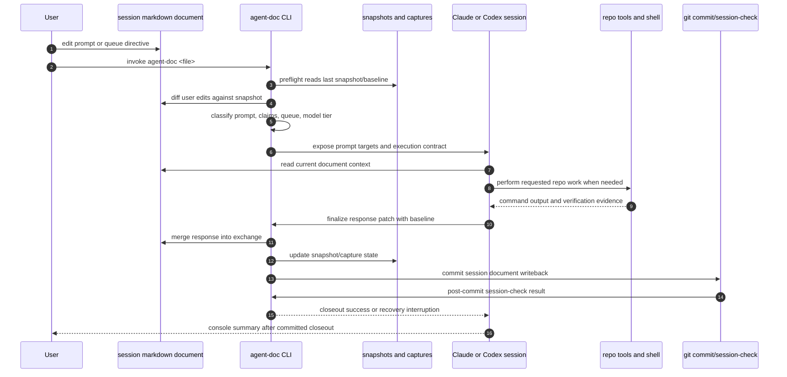
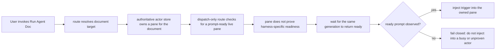
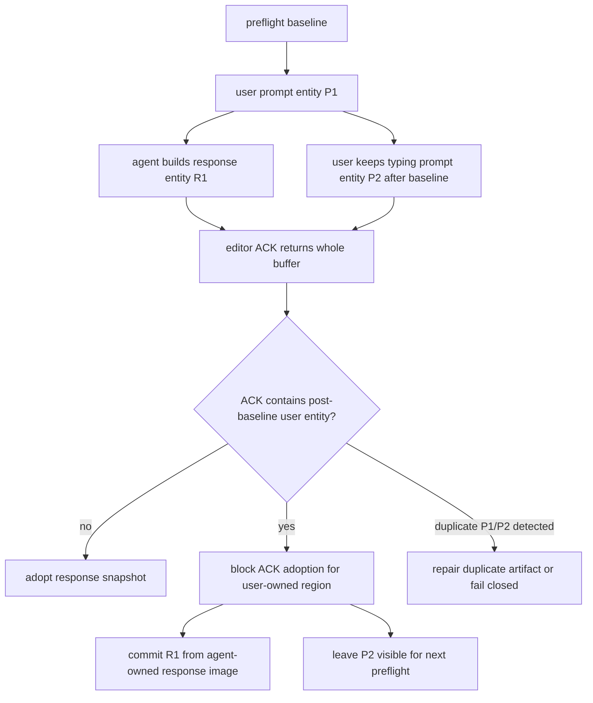
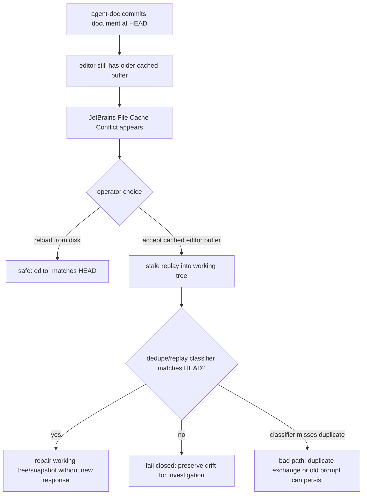
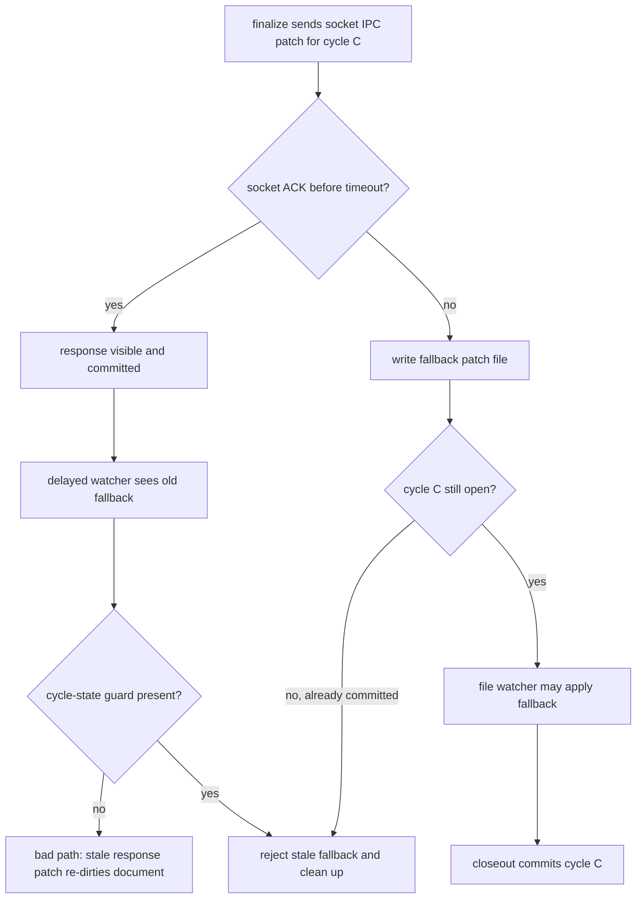

# Active Turn Lifecycle And Replay Paths

This reference stores the generated diagrams for active agent-doc turns, routed
dispatch readiness, post-baseline prompt ownership, JetBrains stale
cache/conflict replay, and late fallback patch replay.

The implementation source of truth remains the Rust code and split specs. Keep
this page current when the implementation, workflow, or architecture changes in
ways that alter these lifecycle boundaries.

## Active Turn Lifecycle

`agent-doc` owns the document lifecycle: preflight, baseline selection, diff
classification, response merge, snapshot/capture state, commit, and
`session-check`. Claude, Codex, or OpenCode owns the live reasoning/tool turn
between `plan` and `finalize`.

A response that only appears in the console is not complete. It becomes part of
the managed turn only after `finalize` writes it into the document and the
binary-owned commit/session-check boundary passes.

## Dispatch Readiness Block

Dispatch-only routing can reuse an authoritative actor only when the live pane
proves it can consume input for the same generation. An idle-looking console is
not enough proof.

This guard prevents a second trigger from being mixed into an active or
unproven turn. Future queue-first dispatch should route repeated dispatches
through a single document lease and a durable queue instead of directly trying
another pane injection.

## Prompt Ownership After Baseline

Whole-buffer editor ACK content is an observation, not authority. If the ACK
contains user-owned prompt text created after preflight, agent-doc must preserve
that prompt for the next cycle and must not absorb it into the committed
snapshot for the current response.

The durable model should distinguish user prompt entities from agent response
entities. Component ranges, content hashes, owner fields, and cycle ids give the
write path enough evidence to preserve post-baseline prompt text without
duplicating older prompts.

## JetBrains Stale Cache Conflict Replay

The intended replay exists because JetBrains may hold an older cached buffer
after disk changed underneath it. If the user accepts that cached editor buffer
hours later, agent-doc should treat the next managed cycle as delayed replay
classification, not as permission to trust the whole buffer.

agent-doc may warn, disable stale patch application, and remove its own stale
sidecars after timeout. It must not dismiss the IDE dialog by choosing disk or
cached content for the user unless the editor exposes an explicit
cancel-agent-patch operation that preserves the user's content choice.

## Late Fallback Patch Replay

Fallback patch replay exists so an IPC timeout can still deliver a response if
the socket path failed while the cycle is still open. After the same cycle is
committed, every fallback for that cycle is stale.

Cycle id, patch id, capture hashes, and terminal closeout state should reject
stale fallback files before they can mutate the editor buffer, snapshot, or
working tree.

## Elimination Boundary

Full-document IPC corruption is eliminated by construction only for first-party
paths that obey these invariants:

- template and component documents use component patches or guarded disk repair;
- first-party senders do not emit `fullContent` payloads for managed documents;
- first-party editor plugins reject or delete legacy `fullContent` payloads;
- ACK/file-read content cannot become snapshot authority when it contains
  post-baseline prompt drift absent from the agent-owned response image;
- committed-cycle fallback patches are rejected by cycle state before visible
  mutation;
- duplicate prompt repair remains defense in depth, not the primary guarantee.

External editors, stale caches, or foreign tools can still write arbitrary
whole-file content. agent-doc can detect, refuse, repair bounded duplicate
shapes, or fail closed in those cases, but it cannot make external writes
impossible.
