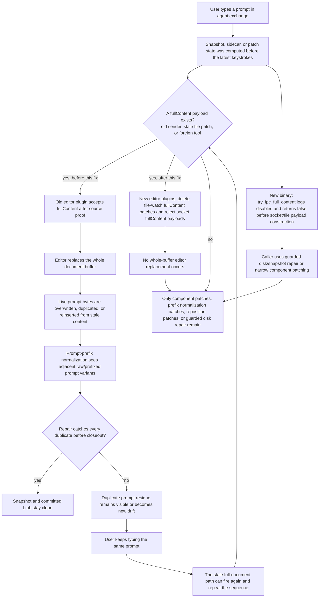

# Full-Document IPC Corruption Chain

This reference records the repeated live failure chain where whole-document
editor IPC could race user typing, leave duplicated prompt text, and then repeat
on the next visible edit. The mitigation is intentionally wide: full-document
IPC is disabled at both the binary sender and editor-plugin receiver.

## Logic Chain

## Disabled Path

- The Rust binary keeps the committed-cycle cleanup guard, then returns `false`
  from full-document IPC paths before constructing socket or file payloads.
- JetBrains and VS Code plugins no longer treat source-buffer proof as
  permission to apply `fullContent`.
- File-watch payloads containing `fullContent` are logged and deleted as
  disabled stale/foreign patches so they cannot retry indefinitely.
- Socket payloads containing `fullContent` fail closed.
- Duplicate prompt repair remains as defense in depth, but correctness no
  longer depends on it catching corruption caused by a whole-buffer editor
  replacement.
