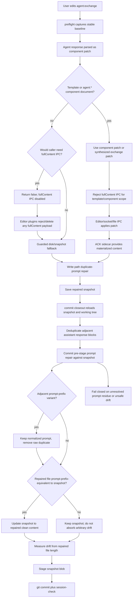

# Prompt Duplicate Closeout Repair

This reference records the process used to prevent duplicate prompt corruption
and unsafe full-document IPC closeout. It focuses on the failure mode where a
template session document has already passed through IPC/write handling, but the
working tree still contains an adjacent normalized/raw copy of the same prompt
before commit closeout.

## Process



## Key Invariants

- Template documents and documents with `agent:*` components must use component
  patches or fail closed for retry when editor repair cannot be proven. They must
  not use full-document IPC for normal response writes.
- Whole-document IPC is disabled in the first-party binary. Any normal response
  path that would emit `fullContent` logs `full_content_ipc_disabled`, returns
  `false`, and cannot authorize a direct disk/snapshot repair without separate
  editor-owned proof.
- Editor plugins also reject or delete legacy/foreign `fullContent` payloads
  without applying them. Source-buffer proof is diagnostic-only.
- Write paths that touch `agent:exchange` run duplicate-prompt repair before
  snapshot trust.
- Commit closeout repeats the safe prompt repair subset before staging. This
  closes failures that appear after IPC has already consumed the response.
- The commit repair is snapshot-bounded: it can remove prompt duplicates already
  represented by the snapshot and adjacent normalized/raw prompt variants, but it
  cannot absorb arbitrary user edits into the snapshot.
- Drift diagnostics use the repaired working-tree length so a fixed duplicate is
  not reported as unresolved out-of-band drift.

## Covered Failure

The named regression shape is:

```text
snapshot:
prompt

working tree:
agent prompt prefix + prompt
prompt
```

Before the fix, closeout could leave this as positive drift and still stage the
snapshot path. The repaired path keeps one normalized prompt, repairs the
working tree, updates the snapshot only when prompt-prefix-equivalent, and logs
`commit_pre_stage_prompt_duplicate_repaired`.

## Regression Tests

- `write::tests::commit_prompt_repair_dedupes_exact_prefixed_raw_prompt_copy`
- `git::tests::commit_repairs_prompt_prefix_duplicate_drift_before_staging`

The wider guard surface remains covered by the duplicate prompt suite plus
regressions that assert no `fullContent` payload is emitted.
