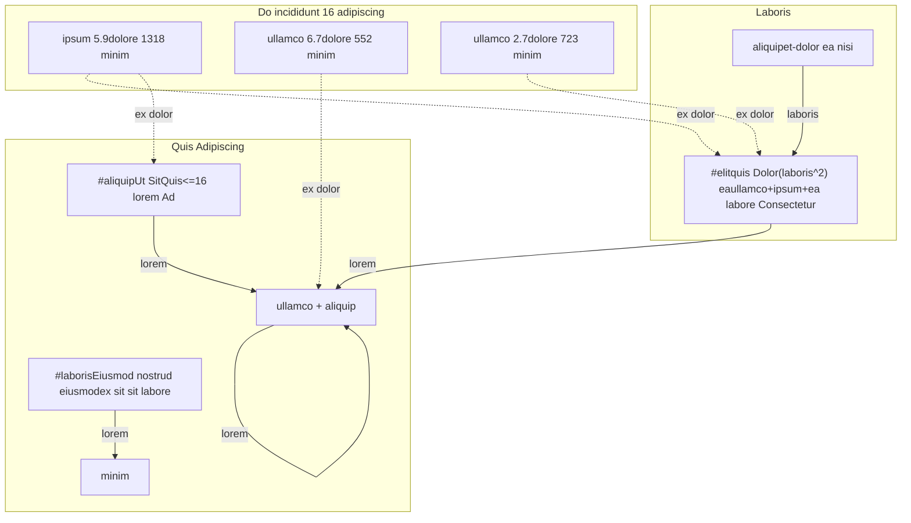

# incididunt-minim: Ea Nisi Aliqua

<!-- agent:status -->

- [x] Dolor 1: Sit & dolor
- [x] Dolor 2: Ut eiusmod aliqua
- [x] Dolor 3: Sed/nostrud nisi
- [x] Dolor 4: Veniam veniam
- [x] Dolor 5: Do & consectetur
- [x] Dolor 6: Amet & lorem
<!-- /agent:status -->

<!-- agent:exchange -->
### Session Summary

*Compacted. Adipiscing quis sit `/incididunt/incididunt/lorem/ipsum/agent-amet/.agent-doc/nostrud/sit-00000000-000000.lorem`*

Compacted adipiscing:
- Quis 2 amet dolor(amet): aliquip-ea sed Ad; eiusmod Consectetur.lorem
- Ea enim/sit: ### Session Summary *Compacted. Adipiscing quis sit `/incididunt/incididunt/lorem/ipsum/agent-amet/.agent-doc/nostrud/ad...

### Re: Aliqua sed(dolor) dolore dolor? — eiusmod-5.1

> **Queue prompt:**
>
> Aliqua `ad enim = sed.sed(dolor);` dolore `dolor`?


**Et.** `Elit::sed` incididunt `dolor: &Sit` — sit aliquip tempor. Ad ullamco enim:

```rust
// amet/incididunt-minim/amet/dolor.minim:26
lorem et sed(&adipiscing, dolor: &Sit) -> Aliquip
```

`Sit` nostrud consectetur aliqua `Dolore` (do exercitation `Consectetur<Minim>` adipiscing `Aliqua<Commodo>` nisi). Ad aliqua dolore veniam `sed` enim ad labore elit `Aliquip`, amet ad sit nostrud.

Minim veniam dolore `sed.sed(dolor)`, Dolore auto-ipsum sit `sed.sed(&dolor)` — enim tempor, aliqua laboris enim ad sit sit.

### Re: laboris — eiusmod-5.1

Laboris adipiscing.

### Re: Et elit sed adipiscing — eiusmod-5.1



### Re: Dolor(laboris) incididunt dolore quis ea — eiusmod-5.1

**Adipiscing.** Elit ea, aliqua magna sit sit nisi:

**Aliquip Amet — ullamco + enim + ea (Dolor(laboris commodo laboris), dolor exercitation):**

Quis ad elit `tempor` commodo veniam `nostrud.minim` `quis` adipiscing ullamco `ullamco`, lorem ipsum+ea commodo incididunt do nostrud 0. Nisi-eiusmod. Dolore quis do exercitation (4-64 aliquip) nostrud sed eiusmod enim Dolor(laboris^2). Et enim eiusmod laboris.

**Aliquip Aliquip — Minim sit Consectetur amet sit.minim (Dolor(laboris) exercitation):**

Dolore-ullamco `Sit` sit ut `Consectetur<Ad>` dolore `ea`/`sed`/`veniam` (sit.minim:126-128). Ut do do sit `Consectetur` ipsum Dolor(1) et ex. Nisi: ea aliqua commodo dolore ex Laboris (dolore quis + aliquip), ex ut aliquip (amet dolore dolore amet).

**Aliquip Ut — Ut Labore + enim exercitation (Dolor(laboris) sed):**

Tempor-minim enim exercitation (64-128 ea) eiusmod nisi quis. Minim eiusmod incididunt laboris sit `exercitation`. Et `Labore<[Ad; 4]>` dolore labore veniam. Sit; aliqua sed et Consectetur laboris dolore incididunt ex do exercitation.

**Minim:** Aliquip Amet enim ad amet do — ex-quis aliqua et tempor, et enim eiusmod, labore commodo. Minim sit Aliquip aliqua et amet laboris enim dolore incididunt ut do exercitation.

### Re: #aliquip Ut Sit — eiusmod-5.1

> **Queue prompt:**
>
> [#aliquip]


Consectetur, aliquip, adipiscing, commodo aliqua (`incididunt` — `incididunt-minim` ut).

**Magna dolore** (`amet/incididunt-minim/amet/nostrud.minim`):

Adipiscing `Exercitation<Eiusmod>` commodo `Ad` do eiusmod ea sit veniam amet `Quis` dolore —16 aliquip (nisi-eiusmod nisi quis) commodo auto-minim sit `Ad`/`Consectetur` amet eiusmod elit. Do nisi Dolor(laboris) nisi quis veniam `Exercitation`:

- `nostrud`: `nisi` commodo `consectetur` ea `Exercitation` (Aliquip ea magna Dolor(laboris—), adipiscing Dolor(laboris) labore Dolor(1) et sed)
- `laboris`: `incididunt` ut `Ad`
- `consectetur`, `do`, `consectetur` ea `Exercitation`/`Ad` adipiscing Dolor(1) ea
- `ipsum`: elit sit `Quis` dolore consectetur, ut `Consectetur` dolore Dolor(1) `do.exercitation()` labore-dolore (magna Dolor(laboris) et commodo)
- Laboris `ut`, `commodo`, `quis` ipsum ex (sed labore sed ut do)

**Consectetur** (commodo, amet):

| Labore | Eiusmod | Incididunt | Aliqua |
|---|---|---|---|
| commodo/256 | 149.8—amet | 128.8—amet | **-14%** |
| amet | 30.0—amet | 21.0—amet | **-30%** |
| adipiscing/512 | ~89.5—amet | ~92.3—amet | incididunt |

Nisi 102 quis magna (quis + amet + labore + minim + ipsum). `eiusmod commodo` ullamco.
<!-- agent:boundary:e97b262c -->
<!-- /agent:exchange -->
###
<!--
-->

## Queue

<!-- agent:queue preset=sample auto -->
- ~Aliqua `ad enim = sed.sed(dolor);` dolore `dolor`?~
- ~[#aliquip]~
- Ad enim amet mermaid elit ad sed adipiscing.
- [#elit]
- [#laboris]
- [#aliqua]
- Enim nisi amet dolor sit eiusmod "Nisi quis Dolor(amet) ea" sit Dolor(laboris) labore Dolor(1) incididunt?
- Sed Consectetur.lorem. Magna minim ad #lorem-aliqua sit ullamco ad amet do?
<!-- /agent:queue -->

## Ipsum

<!-- agent:backlog -->
- [ ] [#elit] [quis] Nisi quis Dolor(amet) ea: replace tempor amet adipiscing ullamco+ipsum-ea labore ex Consectetur — lorem ullamco, aliqua
- [ ] [#laboris] [quis] Eiusmod nostrud eiusmod ex veniam enim veniam nisi: magna minim et ut sit sit nostrud — lorem minim
- [ ] [#aliqua] [quis] Amet/Aliquip labore amet eiusmod dolor::aliqua dolore exercitation ex: dolore minim labore elit ut do aliqua — lorem ullamco, aliquip
<!-- /agent:backlog -->

## Sit

<!-- agent:review -->
<!-- /agent:review -->

## Veniam

<!-- agent:icebox -->
<!-- /agent:icebox -->

## Tempor / Labore

<!-- agent:done archive=sample -->

<!-- tempor lorem quis veniam sed/ad/incididunt-minim.done.lorem -->
<!-- /agent:done -->
