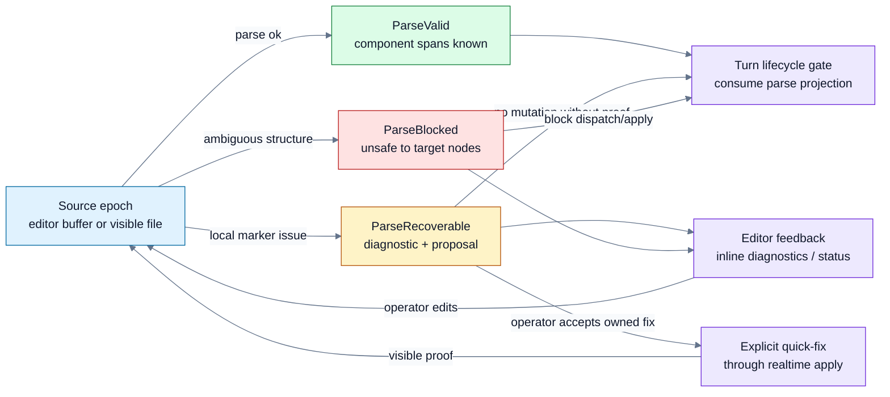

# Real-Time Workflow Authority

This spec is the canonical workflow authority for live session documents. It is
implementation-independent: editor plugins, CRDT transports, IPC payloads,
snapshots, harness hooks, and direct CLI calls may change only if they preserve
these rules or the change is explicitly discussed and accepted.

This is the realtime state machine. For the separate turn/closeout lifecycle
that consumes verified realtime handoffs and owns commits, see
[Turn Lifecycle Authority](15-turn-lifecycle.md).

## Core Invariant

The operator-visible document state is authoritative for every
operator-authored change. An operator change is any text, whitespace, component
body, frontmatter edit, queue/backlog edit, prompt, comment, partial word, or
plugin-defined component content that appears in the editor or visible file and
was not produced by the current binary-owned write.

`content_ours`, snapshots, CRDT sidecars, ACK-content sidecars, and captured
responses are candidates for merge. They are never authority to delete or reset
operator-authored text.

Snapshots are durable backup/audit state, not hot-path authority. Until every
write path carries a structured operation record, a snapshot may temporarily
provide a bounded agent-response candidate, but the hot path must still merge
that candidate into the latest source-of-truth document. A snapshot must never
be load-bearing for deciding what operator-visible state should survive.

## Source Of Truth

When an editor listener owns the document, the live editor buffer is the
source of truth for operator changes. Disk is only a projection of that buffer.
If disk and editor state disagree, the binary must converge through the editor,
wait for proven delivery, or fail closed. It must not use a direct disk write as
an automatic recovery behind the editor.

When no editor listener is active, the current visible file is the source of
truth. A stored snapshot may seed a merge candidate, but merge still applies an
agent delta onto the current file. It must not replace current file content
unless the operator explicitly chose a disk-authoritative recovery.

Out-of-band disk writes, such as saving the file from an editor without the
agent-doc plugin, are operator-authored changes. When no editor listener owns
the document, the next read treats the saved file as `DiskAuthoritative`. When
an editor listener does own the document, the saved file and the live editor
buffer are competing operator sources; the binary must reconcile them, preserve
both when possible, or fail closed before applying any agent delta.

ACK-content proves what an editor observed after a patch. It does not prove that
older snapshot text should overwrite newer operator text.

## Realtime Queue + Exchange Rules

The `agent:queue` and `agent:exchange` components are realtime document state,
not turn-local state. The operator may edit queue items and exchange text while
the queue is running. Every realtime observation must recompute the in-memory
queue projection and exchange update classification from the latest
source-of-truth document, including editor-buffer changes, pluginless disk
saves, backlog mirror inputs, priority markers, auto-DAG dependencies, and
exchange body additions/edits.

Queue recomputation is allowed to update future queue state without retargeting
the current turn. The active HEAD set is the runnable prompt or prompts the
realtime scheduler has proven are currently executing after queue normalization,
backlog sync, priority sorting, auto-DAG topological ordering, and done/review
catch-up strikes. In the common single-owner drain this set has one head. If the
scheduler explicitly owns multiple concurrent heads, the active HEAD set may
have multiple heads.

The `🚧` marker is a projection of the active HEAD set into the visible document;
it is not operator intent, not queue identity, and not an independent scheduling
input. Realtime must update the document so every actively running HEAD carries
the `🚧` marker, and no inactive/drained head carries it. Cosmetic markers such
as `🚧`, `:pushpin:`, and `:round_pushpin:` do not change selected head identity.
If the operator moves `🚧` in the current realtime source epoch, realtime treats
that as a retarget request, validates it through the same auto-DAG dependency
projection, and projects `🚧` onto the selected head plus required prerequisites.
Stale markers left from an older projection are not retarget intent unless the
current diff/source epoch shows the marker move.

The pure queue marker and active-head projection rules live in
`agent-doc-document`. Realtime scheduling consumes those pure functions; turn
lifecycle code consumes the selected-head projection. `agent-doc-orchestration`
may temporarily adapt existing parser and IO surfaces, but it must not be the
long-term owner of `🚧` semantics.

| Operator edit | Realtime queue effect | Current turn effect |
|---|---|---|
| Edit, insert, delete, or reorder a non-selected queue head | Update the in-memory queue projection and backup/audit state. | Does not change the active turn when the selected head identity is unchanged. |
| Edit the selected queue head | Update the queue projection. | Affects the active turn. If the buffer is still being edited, wait/pause; once settled, adopt the edited head as active input. |
| Edit a non-selected head so auto-DAG/priority recomputation changes the selected head | Recompute and persist the new queue projection. | Affects the active turn because the selected head changed. |
| Edit backlog/icebox/pending dependency metadata used by auto-DAG | Recompute dependency order from the latest source. | Affects the active turn when the selected head changes; otherwise it updates future queue state only. |
| Active HEAD set changes for any reason | Move the `🚧` projection to the active HEAD set in the visible document and backup/audit projection. | Affects a turn only when that turn's active HEAD identity changed or other active-turn input changed. |
| Edit `agent:exchange` | Preserve and merge the exchange update. | Always affects the active turn. Exchange edits are never hidden as future queue-only state, even when the same source epoch also changes non-selected queue heads. |

The combined realtime diff state is therefore not simply "file changed" or
"queue changed". It must classify at least these cases:

- `FutureQueueStateOnly`: queue projection changed, selected head identity is
  unchanged, and no exchange update or other active-turn input changed;
- `SelectedQueueHeadChanged`: selected head identity changed because the head
  text changed or queue normalization/auto-DAG selected a different head;
- `ExchangeUpdated`: exchange body or prompt-bearing exchange text changed;
- `MixedExchangeAndQueueUpdate`: exchange updated and queue projection changed
  in the same source epoch.

`FutureQueueStateOnly` may update realtime/backup queue state, including moving
or correcting the `🚧` projection when the active HEAD set identities relevant
to the current turn are unchanged, without replacing the active turn checkpoint.
`SelectedQueueHeadChanged`, `ExchangeUpdated`, and
`MixedExchangeAndQueueUpdate` are active-turn-affecting and must be surfaced to
the turn lifecycle. This classification belongs to realtime authority;
preflight and other lifecycle consumers should consume the classified state
rather than re-deriving it from raw unified diff text.

Auto-DAG is part of realtime queue projection. Dependency edges such as
`after=#id`, queue/backlog priority, and operator/agent priority pins are
recomputed before turn admission decides which queue head is active. A
non-selected queue edit is future-only only after this recomputation proves the
selected head identity did not change. If recomputation selects a different
head, the edit is active-turn input.

This rule separates queue-state convergence from turn lifecycle. Realtime may
apply and verify queue projection updates, but it must not commit them. The
turn lifecycle decides whether the verified state is committed; see
[Turn Lifecycle Authority](15-turn-lifecycle.md).

## Element Models

The realtime document model is composed from per-element realtime models. Each
supported `agent:*` element gets a small pure crate under the
`agent-doc-element-*` family:

| Element crate | Element | Local realtime model | Composition role |
|---|---|---|---|
| `agent-doc-element-exchange` | `agent:exchange` | prompt/response exchange state | local shared surface |
| `agent-doc-element-boundary` | `agent:boundary:*` | inline response boundary marker | projection consumed by exchange/turn closeout |
| `agent-doc-element-queue` | `agent:queue` | active heads, pins, priorities, auto-DAG ordering, `🚧` projection | consumer/projection of runnable work |
| `agent-doc-element-backlog` | `agent:backlog` (`agent:pending` alias) | tracked runnable work items | producer for queue projection |
| `agent-doc-element-review` | `agent:review` | tracked gated work items | local gate state |
| `agent-doc-element-icebox` | `agent:icebox` | tracked parked work items | local parked state, not queue producer |
| `agent-doc-element-done` | `agent:done` | completed-work archive state | archive target |
| `agent-doc-element-status` | `agent:status` | status projection | observer/projection |
| `agent-doc-element-signals` | `agent:signals` | signal definitions and readings | observer across document/runtime models |
| `agent-doc-element-unknown` | unregistered `agent:*` components | generic operator-authoritative component text | local safe fallback |

The base `agent-doc-element` crate defines descriptor vocabulary: marker
names, aliases, source, local realtime model, composition role, write policy,
and authority. `agent-doc-element-registry` composes the built-in
descriptors. These crates are pure: they must not read/write files, open IPC,
run tmux, mutate snapshots, dispatch agents, or commit.

`agent-doc-document` composes element models and owns cross-element invariants:
backlog-to-queue sync, active-head projection, auto-DAG recomputation,
tracked-work archive routing, and signal observations that depend on queue or
turn state. Element crates own local rules only. For example, backlog and
icebox can share a tracked-item model, but only backlog is a runnable work
producer; icebox is parked and must not mirror into `agent:queue`.

`agent-doc-element-unknown` is not a reserved `agent:unknown` document marker.
It is an internal fallback classification for an `agent:*` component whose name
is not known to built-in code or registered plugins. The fallback is
operator-authoritative and merge-only: realtime may preserve and carry the
content, but it must not perform semantic mutations against it.

Plugin-defined custom elements should register additional element descriptors
against the same vocabulary. Plugin loading, version checks, permissions, and
any effectful plugin execution are scheduled for a later runtime/plugin crate.
A plugin element still has to declare its authority and write policy up front.
Until that descriptor is registered, the unknown fallback preserves
operator-visible text.

## Disk Visibility And Durability

Realtime disk authority is based on bytes that are visible through a fresh
read of the document path after the write/save event, not on proof that the
storage device has durably flushed those bytes with `fsync`.

On a local OS, a completed editor save, `rename`, or atomic write is visible to
other processes through the kernel page cache before it is necessarily durable
on physical storage. That read-after-write visibility is the hot-path proof the
realtime state machine needs. Durability barriers (`fsync`, git object writes,
backup snapshots, and commit recovery sidecars) belong to backup, audit,
crash-recovery, or turn-commit boundaries; they must not make snapshots
hot-path authority.

File watcher events are hints, not proof. After a watcher event or pluginless
save, realtime must reopen/read the current file, compute the digest/epoch it
will use, and either observe a stable parseable document or enter
`ParseRecoverable`, `ParseBlocked`, `DiskDriftObserved`, or `ConflictBlocked`.
If a writer exposes a partially written file, the realtime loop waits for a
stable read/epoch or fails closed. It must not merge against stale buffered
content merely because a save notification fired.

## Realtime States

These states describe document authority, not the agent turn/cycle. Agent cycle
states such as idle, `preflight_started`, `response_captured`, `write_applied`,
post-preflight, and committed may schedule work, but they must not change the
realtime authority rules.

| State | Authority | Meaning | Allowed next action |
|---|---|---|---|
| `DiskAuthoritative` | Current visible file | No editor listener currently owns the document. | Build a merge against the file, or wait for an editor attach. |
| `EditorDirty` | Live editor buffer | An editor owns the document and has unquiesced, unsaved, or in-flight edits. | Wait, observe CRDT/editor epochs, or fail closed. |
| `EditorQuiescent` | Live editor buffer | The editor owns the document and the debounce/epoch barrier is quiet. Disk may still be only a projection. | Build a merge against the editor-visible state and apply through editor/CRDT transport. |
| `DiskDriftObserved` | Live editor buffer plus current file as operator inputs | Disk changed outside the owning editor, such as a pluginless editor save, while an editor listener owns the document. | Reconcile disk and editor operator edits through the owner, or fail closed. |
| `AgentDeltaReady` | Prior source-of-truth plus structured agent intent | The binary has an agent-owned operation candidate, such as appending a response or compacting `agent:exchange`. | Call `agent-doc-merge` with the latest realtime document. |
| `MergePlanned` | Latest source-of-truth plus merge output | The pure merge core produced a patch plan or merged document that preserves operator text. | Deliver the plan through the owning transport. |
| `ApplyInFlight` | Pre-apply source-of-truth remains authoritative | A patch/write has been sent but delivery is not proven. | Wait for ACK/content proof, retry through the owner, or fail closed. |
| `AppliedVerified` | Post-apply source-of-truth | The owner-visible document contains the agent operation and preserves observed operator text. | Save backup state and commit. |
| `ConflictBlocked` | Current source-of-truth | Merge or delivery could not prove preservation of operator text. | Leave the document untouched and report/retry later. |

Editor-sidecars that prove a live editor buffer must also carry a stable
frontend capability proof before the controller treats that editor as safe for
operator-preserving mutation. The canonical capability for this invariant is
`operator_text_authority_v1`: the editor reports full visible buffer content,
per-editor identity, and enough local operation/epoch evidence for the harness
to avoid discarding operator text. A live-buffer sidecar from an older or
capability-unknown frontend is still authoritative operator input, but it is not
safe delivery proof. This is true even when the reported buffer currently equals
disk: the unsafe race is between delivery and the operator's next keystroke. The
controller must enter `ConflictBlocked` (or an equivalent fail-closed closeout)
before sending a patch that could overwrite that buffer. This applies to every
editor mutation transport, including normal writeback, compact exchange,
normalization repair, IPC dedupe repair, full-content repair redelivery, socket
delivery, and file-IPC fallback. Reloading/updating the editor frontend can
replace the sidecar with a capability-bearing report; direct disk overwrite
remains an explicit operator escape hatch only.

Snapshots never create a realtime state. A snapshot can contribute a candidate
delta to `AgentDeltaReady`; it cannot move a document to `MergePlanned`,
`ApplyInFlight`, or `AppliedVerified` by itself.

The diagrams pin their Mermaid palette instead of inheriting page colors. Nodes
and edge labels use opaque fills, dark text, and mid-contrast links so they stay
readable in both light and dark renderers.

```mermaid
%%{init: {"theme": "base", "themeVariables": {"background": "transparent", "primaryTextColor": "#0f172a", "fontFamily": "ui-sans-serif, system-ui, sans-serif", "lineColor": "#64748b", "edgeLabelBackground": "#f8fafc", "clusterBkg": "#ffffff", "clusterBorder": "#94a3b8"}}}%%
flowchart LR
    DiskAuthoritative["DiskAuthoritative<br/>authority: current visible file"]
    EditorDirty["EditorDirty<br/>authority: live editor buffer"]
    EditorQuiescent["EditorQuiescent<br/>authority: live editor buffer"]
    DiskDriftObserved["DiskDriftObserved<br/>pluginless disk edit while editor owns"]
    AgentDeltaReady["AgentDeltaReady<br/>structured agent intent"]
    MergePlanned["MergePlanned<br/>operator-preserving plan"]
    ApplyInFlight["ApplyInFlight<br/>delivery not yet proven"]
    AppliedVerified["AppliedVerified<br/>post-apply source verified"]
    ConflictBlocked["ConflictBlocked<br/>leave document untouched"]
    Snapshot["Snapshot<br/>backup/audit only"]

    DiskAuthoritative -- editor attaches --> EditorDirty
    EditorDirty -- debounce/epoch settle --> EditorQuiescent
    EditorQuiescent -- operator edits --> EditorDirty
    EditorQuiescent -- clean detach --> DiskAuthoritative
    EditorDirty -- clean detach after projection proof --> DiskAuthoritative
    DiskAuthoritative -- pluginless editor saves --> DiskAuthoritative
    EditorDirty -- pluginless editor saves --> DiskDriftObserved
    EditorQuiescent -- pluginless editor saves --> DiskDriftObserved
    DiskDriftObserved -- reconcile operator sources --> EditorDirty
    DiskDriftObserved -- conflict or unproven merge --> ConflictBlocked

    DiskAuthoritative -- build operation --> AgentDeltaReady
    EditorQuiescent -- build operation --> AgentDeltaReady
    EditorDirty -- cannot prove stable source --> ConflictBlocked
    DiskDriftObserved -- agent delta waits --> ConflictBlocked
    Snapshot -. bounded candidate only .-> AgentDeltaReady
    Snapshot -. forbidden .-> AppliedVerified

    AgentDeltaReady -- agent-doc-merge succeeds --> MergePlanned
    AgentDeltaReady -- typed conflict --> ConflictBlocked
    MergePlanned -- deliver through owner --> ApplyInFlight
    ApplyInFlight -- ACK/content plus visible verification --> AppliedVerified
    ApplyInFlight -- stale ACK/new operator edit --> EditorDirty
    ApplyInFlight -- no editor and file changed --> DiskAuthoritative
    ApplyInFlight -- ambiguous/fails proof --> ConflictBlocked
    AppliedVerified -- realtime handoff complete --> EditorQuiescent
    AppliedVerified -- realtime handoff complete --> DiskAuthoritative

    classDef source fill:#e0f2fe,stroke:#0369a1,color:#0f172a;
    classDef work fill:#ede9fe,stroke:#6d28d9,color:#0f172a;
    classDef verify fill:#dcfce7,stroke:#15803d,color:#0f172a;
    classDef blocked fill:#fee2e2,stroke:#b91c1c,color:#0f172a;
    classDef backup fill:#fef3c7,stroke:#b45309,color:#0f172a,stroke-dasharray: 5 3;
    classDef split fill:#ffedd5,stroke:#c2410c,color:#0f172a;

    class DiskAuthoritative,EditorDirty,EditorQuiescent source;
    class DiskDriftObserved split;
    class AgentDeltaReady,MergePlanned,ApplyInFlight work;
    class AppliedVerified verify;
    class ConflictBlocked blocked;
    class Snapshot backup;
```

## State Transitions

Realtime transitions are continuous and must work regardless of agent state:

| Event | From | To | Required proof |
|---|---|---|---|
| Editor listener attaches | `DiskAuthoritative` | `EditorDirty` or `EditorQuiescent` | The editor publishes a live buffer identity/epoch for the document. |
| Editor listener detaches cleanly | `EditorDirty` or `EditorQuiescent` | `DiskAuthoritative` | Disk projection is current, or the detach path fails closed until current state is known. |
| Operator types, deletes, or plugin-mutates text | Any editor-owned state | `EditorDirty` | The edit is observed in the live buffer or CRDT/editor epoch. |
| Pluginless editor or external process saves the file with no editor owner | `DiskAuthoritative` | `DiskAuthoritative` | The next read observes the saved file as the source of truth; snapshots and `content_ours` do not overwrite it. |
| Pluginless editor or external process saves the file while an editor owns the document | `EditorDirty`, `EditorQuiescent`, or `ApplyInFlight` | `DiskDriftObserved` | Current file digest differs from the editor-owned projection or apply baseline. |
| Disk/editor operator sources reconcile | `DiskDriftObserved` | `EditorDirty` or `EditorQuiescent` | The editor-visible buffer includes all preserved disk and editor operator edits. |
| Disk/editor operator sources conflict | `DiskDriftObserved` | `ConflictBlocked` | Typed conflict proves the operator sources cannot be safely combined automatically. |
| Debounce and editor epoch settle | `EditorDirty` | `EditorQuiescent` | Latest editor-visible text is known and no in-flight local edit remains. |
| Agent response, queue operation, pending mutation, or compact operation is captured | Any source state | `AgentDeltaReady` | The operation is narrowed to the binary-owned node/intent; snapshots are only a fallback source for this candidate. |
| Merge succeeds | `AgentDeltaReady` plus latest realtime source | `MergePlanned` | `agent-doc-merge` proves operator text is preserved or explicitly owned by the operation. |
| Merge conflicts | `AgentDeltaReady` plus latest realtime source | `ConflictBlocked` | Typed conflict describing the same-node or ambiguous placement failure. |
| Editor/CRDT delivery starts | `MergePlanned` with editor owner | `ApplyInFlight` | Patch plan targets the current editor-visible baseline or node proof. |
| Disk delivery starts | `MergePlanned` with no editor owner | `ApplyInFlight` | Current file still matches the merge input, or the merge is recomputed first. |
| Delivery ACK/content verifies | `ApplyInFlight` | `AppliedVerified` | Owner-visible text contains the agent delta and every observed operator edit. |
| Delivery fails, ACK mismatches, or a newer operator edit appears | `ApplyInFlight` | `EditorDirty`, `DiskAuthoritative`, or `ConflictBlocked` | The stale plan is discarded; the next attempt must re-read source-of-truth and merge again. |
| Realtime handoff completes | `AppliedVerified` | `EditorQuiescent` or `DiskAuthoritative` | Realtime publishes the verified apply proof and latest source-of-truth text without committing. |

Forbidden transitions:

- `Snapshot -> AppliedVerified`;
- `ACK-content -> AppliedVerified` without comparing the owner-visible document;
- `AgentDeltaReady -> ApplyInFlight` without `agent-doc-merge`;
- `DiskDriftObserved -> AgentDeltaReady` before reconciling disk and editor
  operator sources;
- `MergePlanned` or `ApplyInFlight` to any document commit;
- `agent-doc-merge` or `agent-doc-realtime` running `git commit`;
- any transition that drops visible operator text to match `content_ours`, a
  snapshot, a CRDT sidecar, or an ACK-content sidecar.

## Realtime Parse State

Document parsing is a separate realtime state machine. It runs over the same
source-of-truth document chosen by the authority machine above, but it answers a
different question: can the binary safely identify document components, spans,
frontmatter, response blocks, queue/backlog nodes, and operation targets without
guessing?

The parse state is a lazily-backed projection in `agent-doc-realtime`. It is
recomputed after every editor or disk epoch and is mirrored to editor plugins
through the lazily-spec snapshot/delta graph. The parser should be pure
document logic, with no access to turns, git, sockets, clocks, or repair policy.
A future `agent-doc-parse` or document-model crate may own this pure parser, but
the realtime scheduler owns when the latest parse projection is observed and
published.

| State | Meaning | Allowed next action |
|---|---|---|
| `ParseValid` | The latest source-of-truth document has a valid component/frontmatter/span model. | Merge/apply may target parsed nodes after the authority state is also safe. |
| `ParseRecoverable` | The document has a local marker, boundary, or syntax issue with a deterministic diagnostic and optional structured repair proposal. | Surface feedback and wait for operator/editor action, or apply an explicitly owned realtime quick-fix with visible-state proof. |
| `ParseBlocked` | The parser cannot safely identify the nodes needed for dispatch, merge, compact, or commit closeout. | Block turn dispatch or realtime apply; keep the document visible and report diagnostics. |

The editor plugins must surface parse issues as realtime feedback: inline
diagnostics, gutter/status feedback, and quick-fix proposals when a structured
fix exists. This feedback is advisory until the operator edits the document or
accepts a quick-fix that then crosses the same realtime authority, merge, apply,
and visible-verification path as any other document mutation.

Preflight consumes the latest parse projection; it does not own parse recovery:
preflight repair must not be the normal parse recovery path. Repair is a narrow
crash/retry backstop for already-captured lifecycle state, not a substitute for
continuous parse diagnostics over the live document. A `ParseBlocked` document
must remain operator-visible and block unsafe dispatch/apply instead of being
silently rewritten into a guessed valid shape.

```mermaid
%%{init: {"theme": "base", "themeVariables": {"background": "transparent", "primaryTextColor": "#0f172a", "fontFamily": "ui-sans-serif, system-ui, sans-serif", "lineColor": "#64748b", "edgeLabelBackground": "#f8fafc", "clusterBkg": "#ffffff", "clusterBorder": "#94a3b8"}}}%%
flowchart LR
    Source["Read latest source-of-truth<br/>editor buffer or current visible file"]
    Oob{"Out-of-band disk write<br/>observed?"}
    Split["DiskDriftObserved<br/>disk and editor are operator sources"]
    Dirty{"Editor dirty<br/>or epoch in flight?"}
    Wait["Wait for debounce/epoch<br/>or fail closed"]
    Delta["Build bounded agent delta<br/>from structured operation"]
    SnapshotCandidate["Snapshot-derived response candidate<br/>legacy fallback only"]
    Merge["Call agent-doc-merge<br/>latest source + agent intent"]
    Conflict["Typed conflict<br/>same-node or ambiguous placement"]
    Plan["Patch plan / merged document<br/>operator text preserved"]
    Owner{"Editor owns<br/>document?"}
    EditorApply["Apply through editor/CRDT<br/>node proof or current baseline"]
    DiskApply["Apply to disk only after<br/>current-file proof"]
    InFlight["ApplyInFlight<br/>source remains authoritative"]
    Verify{"Post-apply visible state<br/>contains agent delta<br/>and operator edits?"}
    Handoff["Hand off verified proof<br/>to document turn lifecycle"]
    TurnLifecycle["Document turn lifecycle<br/>may save backup/commit"]
    Block["ConflictBlocked<br/>leave document untouched"]

    Source --> Oob
    Oob -- no --> Dirty
    Oob -- "yes; no editor owner" --> Dirty
    Oob -- "yes; editor owner" --> Split
    Split -- "reconcile disk + editor edits" --> Source
    Split -- "conflict/unproven" --> Block
    Dirty -- yes --> Wait
    Wait -- settled --> Source
    Wait -- cannot prove --> Block
    Dirty -- no --> Delta
    SnapshotCandidate -. narrowed candidate .-> Delta
    Delta --> Merge
    Merge -- conflict --> Conflict --> Block
    Merge -- success --> Plan
    Plan --> Owner
    Owner -- yes --> EditorApply --> InFlight
    Owner -- no --> DiskApply --> InFlight
    InFlight --> Verify
    Verify -- yes --> Handoff
    Handoff -. "optional commit outside realtime" .-> TurnLifecycle
    Verify -- "no: stale ACK/new edit/mismatch" --> Block
    InFlight -- newer operator edit observed --> Source

    classDef source fill:#e0f2fe,stroke:#0369a1,color:#0f172a;
    classDef decision fill:#f8fafc,stroke:#475569,color:#0f172a;
    classDef work fill:#ede9fe,stroke:#6d28d9,color:#0f172a;
    classDef verify fill:#dcfce7,stroke:#15803d,color:#0f172a;
    classDef blocked fill:#fee2e2,stroke:#b91c1c,color:#0f172a;
    classDef backup fill:#fef3c7,stroke:#b45309,color:#0f172a,stroke-dasharray: 5 3;
    classDef split fill:#ffedd5,stroke:#c2410c,color:#0f172a;

    class Source,Wait source;
    class Dirty,Oob,Owner,Verify decision;
    class Split split;
    class Delta,Merge,Plan,EditorApply,DiskApply,InFlight work;
    class Handoff verify;
    class TurnLifecycle backup;
    class Conflict,Block blocked;
    class SnapshotCandidate backup;
```

## Mutation Protocol

Every document mutation that can affect a session document follows this order:

1. Read the latest source-of-truth document after the quiescence gate.
2. If disk changed outside the owning editor, reconcile the disk and editor
   operator sources first. With no editor owner, the current file is the source;
   with an editor owner, enter `DiskDriftObserved` and preserve both operator
   sources or fail closed.
3. Build an agent delta for the nodes the binary owns in this operation.
   Prefer structured operation/capture state. A snapshot-derived delta is a
   legacy fallback and must be narrowed before merge.
4. Rebase that delta against the latest source-of-truth document immediately
   before apply.
5. If the operator changed the same node, preserve the operator change and
   either merge the agent response around it with explicit proof or fail closed.
6. If the operator changed a disjoint node, keep both changes.
7. Apply through the editor/CRDT transport when an editor listener is active;
   use disk only when no listener is active or the operator explicitly chose a
   disk-authoritative recovery.
8. Verify the post-apply source-of-truth document contains the agent response
   and still contains every operator-authored line observed before the apply.
9. Return the verified apply proof and latest source-of-truth text to the
   document turn lifecycle. Do not commit from merge or realtime code.

## Commit Boundary

CRDT merge does not commit. `agent-doc-merge` returns only a merged
document/patch plan or a typed conflict. `agent-doc-realtime` may schedule,
deliver, and verify that plan against the current editor or disk source of
truth, but merge/realtime paths must not run git commit, advance the document
turn lifecycle, or decide closeout success.

The document turn lifecycle owns commits. It may commit after it has the
captured response, pending-operation decisions, verified apply proof, current
source-of-truth text, and the selected write policy. It may also intentionally
leave a verified realtime merge uncommitted, such as a compact preview, a retry
handoff, or an operator-selected no-commit flow. Saving backup/audit state can
be part of lifecycle closeout, but backup writes are not realtime authority.

## Document Projection Crate Boundary

`agent-doc-document` owns pure document projections that can be computed from
document text and typed facts without disk, git, editors, tmux, clocks, or turn
state. Current responsibilities include:

- queue in-progress marker identity and projection;
- active HEAD projection from queue rows, marker-retarget requests, and
  auto-DAG prerequisite expansion;
- future pure parse/document views used by realtime diagnostics.

`agent-doc-document` does not commit, dispatch turns, run repair, call tmux,
or decide lifecycle closeout. It returns document-state facts for
`agent-doc-realtime` and `agent-doc-turn` to consume.

## Merge Crate Boundary

The pure boundary is the `agent-doc-merge` crate. It owns document merge,
conflict resolution, and operation semantics as pure functions. It has no
access to disk, git, sockets, editor APIs, cycle state, ops logs, snapshots, or
clocks.

Inputs include:

- the latest operator-visible document;
- the proposed agent delta or replacement node;
- the operation intent, such as `append_response`, `replace_exchange_for_compact`,
  `queue_consume`, or `pending_mutation`;
- optional base/CRDT state when available.

Outputs are a merged document/patch plan or a typed conflict. The merge core
must preserve disjoint operator edits, keep same-node operator changes unless
the operation explicitly owns the node with proof, and distinguish normal
response append from explicit exchange replacement.

`agent-doc-realtime` is a separate later boundary for scheduling/lifecycle:
editor ownership, debounce, CRDT transport, live-buffer publication, retry
timing, and owner leases. Realtime orchestration may decide when to call the
merge core and how to deliver its patch plan, but it must not redefine document
authority.

## Lazily-RS State Backbone

`agent-doc-realtime` must use `lazily-rs` for realtime state. The authority
state machine above, editor/disk epochs, owner leases, in-flight apply facts,
disk-drift facts, and retry/fail-closed decisions are lazily-backed state
projections, not ad hoc globals, snapshots, or turn-local sidecars.

The Rust implementation uses `lazily::ThreadSafeStateMachine` for closed
transition domains and `lazily::ThreadSafeContext` for the per-document
projection context. The projection is exposed through the existing lazily-spec
snapshot/delta graph so JetBrains (`lazily-kt`) and VS Code (`@lazily/js`) can
mirror the same realtime state without reparsing raw logs or session files.

Durable storage may keep append-only facts, checkpoints, and backup snapshots,
but the hot path reads the lazily-backed projection when deciding:

- which source currently owns document authority;
- whether disk drift is `DiskAuthoritative` or `DiskDriftObserved`;
- whether an apply is still `ApplyInFlight` or has reached `AppliedVerified`;
- whether a stale ACK, stale generation, missing owner lease, or out-of-band
  disk write forces a retry or `ConflictBlocked`;
- which editor/plugin mirror has the latest observed epoch.

Cycle state remains separate. It may request work or retain a captured response,
but it must not carry realtime document authority. Any future
`agent-doc-realtime` crate should therefore depend on `agent-doc-document` for
pure document projections, `agent-doc-merge` for pure merge semantics,
`agent-doc-turn-executor`/executor-specific model crates for dispatch-readiness
facts, `agent-doc-tmux` for shared tmux observations where tmux is the active
executor family, `agent-doc-supervisor` for supervisor realtime observations and
pure lifecycle decisions, and lazily-rs for its state machine/projection
substrate.
Tmux command construction and subprocess effects remain outside the realtime
authority core in `agent-doc-tmux-commands` and `agent-doc-tmux-io`.
Supervisor spawn/kill/reexec/socket effects belong in
`agent-doc-supervisor-process`, while durable project control-plane RPC/CAS
belongs in `agent-doc-controller`.

## Forbidden Shapes

The following are correctness violations:

- replacing a template session document with full-content IPC;
- adopting `content_ours` or a snapshot as a whole document when a narrower
  agent delta can be rebased onto the current visible document;
- dropping any visible operator-authored text, including non-prompt text;
- using ACK-content or a socket `already_applied` result to authorize a
  whole-document replacement;
- treating a pluginless editor save or other out-of-band disk write as stale
  drift to reset from `content_ours`, a snapshot, ACK-content, or HEAD;
- storing realtime authority only in a turn-local cycle sidecar, backup
  snapshot, ops log, or harness state instead of a lazily-backed projection;
- sending live-prompt-drift recovery patches for non-response components or
  frontmatter;
- treating operator-origin authority as future work or as gated by a later CRDT
  hookup;
- direct harness patchback of an assistant response into the session document.

## Harness Contract

Claude Code, Codex, OpenCode, Cursor, editor actions, Stop hooks, and direct
terminal runs all share the same boundary:

- response persistence goes through `agent-doc finalize` or
  `agent-doc write --commit`;
- hooks may recover an interrupted turn only by replaying through the binary
  write/commit path;
- harnesses may insert a missing user prompt before a response exists, but they
  must not patch the assistant response directly into the document;
- a stale MCP server or other long-lived tool host whose running binary,
  executable path, generated instructions, or mutation contract is no longer
  launchable/current must refuse mutating tools such as `agent_doc_admit`,
  `agent_doc_preflight`, and `agent_doc_finalize` until restarted or recycled;
- untrusted, stale, or missing delivery proof is a fail-closed result, not
  permission to write the session document directly.

Queue and backlog items may request proof, tests, or cleanup for this invariant.
They must not describe operator authority as optional, deferred, or dependent on
a future implementation phase.

## Minimum Regression Coverage

Implementations must keep tests for these cases:

- ordinary non-prompt operator text typed during closeout is preserved;
- queue and backlog edits typed during closeout are preserved;
- live-prompt-drift recovery rebases only the missing response block onto the
  realtime document;
- compact exchange remains explicit `agent:exchange` replacement and preserves
  concurrent non-exchange edits;
- out-of-band disk writes with no editor owner are preserved as the current
  visible file state;
- out-of-band disk writes while an editor owns the document reconcile with the
  live editor buffer or fail closed before any agent response lands;
- ACK-content drift cannot reset operator-visible file content;
- harness Stop-hook recovery cannot commit transcript-shaped or direct-patched
  responses.
