# Turn Lifecycle Authority

This spec owns the document turn lifecycle state machine. It is distinct from
the realtime document-authority state machine in
[Real-Time Workflow Authority](14-realtime-workflow.md).

Document realtime owns live source-of-truth selection, editor/disk epochs,
merge/apply planning, realtime parse-state projection, and post-apply
visible-state verification. The turn lifecycle owns admission, preflight, agent
dispatch, response capture, pending-operation
decisions, selected write policy, backup/audit updates, and commits.
The Rust pure lifecycle state machine lives in `agent-doc-turn`.

Hard invariants:

- document turn lifecycle owns commits;
- agent-doc-merge does not commit;
- `agent-doc-document-realtime` does not commit;
- realtime handoff proof is an input to turn closeout, not a commit by itself;
- turn-executor readiness gates dispatch, but executors do not own document
  merge, queue projection, or commits;
- preflight consumes the realtime parse projection; `ParseBlocked` moves the
  turn to `InterruptedBlocked` instead of running surprise repair;
- commit is optional when the selected turn policy is no-commit;
- interrupted closeout must resume from durable lifecycle state or fail closed;
- snapshots and CRDT sidecars are backup/audit or merge inputs, never lifecycle
  authority that can drop operator-visible text.

The persisted `CyclePhase` sidecar is a durable recovery projection of this
larger state machine. Today it records `preflight_started`,
`response_captured`, `write_applied`, `committed`, and `abandoned`. Those phases
must stay below the lifecycle boundary: they aid restart/replay, but they do not
replace realtime source authority.

## Turn States

| State | Owner | Meaning | Exit requirement |
|---|---|---|---|
| `Idle` | lifecycle | No open turn is owned by this process. | A prompt, queue head, or explicit finalize request is admitted. |
| `Admitted` | lifecycle | A response cycle checkpoint exists or is about to be opened for the document. | Preflight opens a cycle or determines the request is a no-op/abandonable probe. |
| `PreflightOpened` | lifecycle | Prompt targets, queue head, pending facts, baseline hashes, and realtime parse state are captured for the turn. | Agent prompt is dispatched, `ParseBlocked` interrupts the turn, or the cycle is abandoned before response capture. |
| `PromptDispatched` | harness | The selected backend has received the turn prompt. | Backend starts producing output, rejects dispatch, or the harness reports interruption. |
| `AgentRunning` | harness | The backend is producing or may produce the assistant response. | Final response is captured, the turn is cancelled, or the harness fails. |
| `ResponseCaptured` | lifecycle | Final assistant response is durably captured for replay. | Build the lifecycle-owned operation set and request realtime apply/verification. |
| `RealtimeApplyPending` | realtime+lifecycle | The lifecycle has a bounded operation set and is waiting for realtime merge/apply/verify. | Realtime returns a verified handoff proof, a typed conflict, or an unproven delivery result. |
| `RealtimeApplyVerified` | lifecycle | The latest source-of-truth text contains the agent-owned delta and preserved operator edits. | Apply the selected closeout policy: commit, no-commit, retry, or fail closed. |
| `CommitPending` | lifecycle | Backup/audit state, index staging, tracked-work mutations, and git commit are in progress. | Commit succeeds, no-op commit is proven, or a recoverable/blocked closeout is recorded. |
| `Committed` | lifecycle | Closeout crossed the selected commit boundary and terminal state is recorded. | Later prompts start a new turn; duplicate terminal bookkeeping is ignored. |
| `NoCommitComplete` | lifecycle | The selected policy intentionally leaves the verified document uncommitted. | Later prompt/commit policy starts a new turn or commits through an explicit lifecycle command. |
| `InterruptedBlocked` | lifecycle | Closeout cannot prove safe progress, often because editor convergence, response capture, or commit proof is missing. | Retry from durable lifecycle state, recover through operator-selected policy, or abandon when no response was captured. |
| `Abandoned` | lifecycle | A pre-response turn was safely closed without writing a response. | Later prompt starts a new turn. |

The diagram pins its Mermaid palette instead of inheriting page colors. Nodes
and edge labels use opaque fills, dark text, and mid-contrast links so they stay
readable in both light and dark renderers.

```mermaid
%%{init: {"theme": "base", "themeVariables": {"background": "transparent", "primaryTextColor": "#0f172a", "fontFamily": "ui-sans-serif, system-ui, sans-serif", "lineColor": "#64748b", "edgeLabelBackground": "#f8fafc", "clusterBkg": "#ffffff", "clusterBorder": "#94a3b8"}}}%%
flowchart LR
    Idle["Idle<br/>no open turn"]
    Admitted["Admitted<br/>cycle checkpoint accepted"]
    PreflightOpened["PreflightOpened<br/>prompt/baseline facts"]
    PromptDispatched["PromptDispatched<br/>backend received turn"]
    AgentRunning["AgentRunning<br/>backend producing output"]
    ResponseCaptured["ResponseCaptured<br/>durable response body"]
    RealtimeApplyPending["RealtimeApplyPending<br/>request merge/apply proof"]
    RealtimeApplyVerified["RealtimeApplyVerified<br/>handoff proof received"]
    CommitPending["CommitPending<br/>turn lifecycle commit path"]
    Committed["Committed<br/>terminal committed turn"]
    NoCommitComplete["NoCommitComplete<br/>verified but uncommitted"]
    InterruptedBlocked["InterruptedBlocked<br/>retry or operator recovery"]
    Abandoned["Abandoned<br/>pre-response close"]

    Idle -- admit prompt/finalize --> Admitted
    Admitted -- open cycle --> PreflightOpened
    Admitted -- no response and no work --> Abandoned
    PreflightOpened -- parse valid/recoverable and dispatch backend --> PromptDispatched
    PreflightOpened -- ParseBlocked --> InterruptedBlocked
    PreflightOpened -- probe/cancel before response --> Abandoned
    PromptDispatched -- accepted --> AgentRunning
    PromptDispatched -- dispatch failed --> InterruptedBlocked
    AgentRunning -- final response captured --> ResponseCaptured
    AgentRunning -- cancelled before capture --> Abandoned
    AgentRunning -- harness interrupted --> InterruptedBlocked
    ResponseCaptured -- build bounded operations --> RealtimeApplyPending
    RealtimeApplyPending -- realtime handoff proof --> RealtimeApplyVerified
    RealtimeApplyPending -- conflict or unproven apply --> InterruptedBlocked
    RealtimeApplyVerified -- commit policy --> CommitPending
    RealtimeApplyVerified -- no-commit policy --> NoCommitComplete
    CommitPending -- git commit or no-op proof --> Committed
    CommitPending -- commit/convergence blocked --> InterruptedBlocked
    InterruptedBlocked -- retry durable closeout --> ResponseCaptured
    InterruptedBlocked -- safe pre-response abandon --> Abandoned
    Committed -- new prompt --> Idle
    NoCommitComplete -- new lifecycle command --> Idle
    Abandoned -- new prompt --> Idle

    classDef lifecycle fill:#e0f2fe,stroke:#0369a1,color:#0f172a;
    classDef harness fill:#ede9fe,stroke:#6d28d9,color:#0f172a;
    classDef realtime fill:#dcfce7,stroke:#15803d,color:#0f172a;
    classDef terminal fill:#f8fafc,stroke:#475569,color:#0f172a;
    classDef blocked fill:#fee2e2,stroke:#b91c1c,color:#0f172a;

    class Idle,Admitted,PreflightOpened,ResponseCaptured,CommitPending lifecycle;
    class PromptDispatched,AgentRunning harness;
    class RealtimeApplyPending,RealtimeApplyVerified realtime;
    class Committed,NoCommitComplete,Abandoned terminal;
    class InterruptedBlocked blocked;
```

## Turn State Transitions

| Event | From | To | Required proof |
|---|---|---|---|
| Prompt or finalize admitted | `Idle` | `Admitted` | The caller owns the document session or is using a valid harness-neutral closeout path. |
| Preflight starts | `Admitted` | `PreflightOpened` | Durable cycle id, source hashes, prompt targets, queue head, pending facts, latest parse projection, and selected harness are recorded. |
| Parse projection blocks targeting | `PreflightOpened` | `InterruptedBlocked` | Realtime parse state is `ParseBlocked`; editor diagnostics identify the parse issue and no lifecycle repair mutates the document. |
| Pre-response no-op/probe ends | `Admitted` or `PreflightOpened` | `Abandoned` | No response body was captured and no operator-visible mutation is needed. |
| Backend dispatch accepted after parse gate | `PreflightOpened` | `PromptDispatched` | Realtime parse state is `ParseValid`, or `ParseRecoverable` with diagnostics that do not affect the targeted operation; the harness reports the prompt was accepted or the owned pane entered turn-active state. |
| Backend starts/continues output | `PromptDispatched` | `AgentRunning` | Harness turn-active evidence or streamed output belongs to this cycle. |
| Final response captured | `AgentRunning` | `ResponseCaptured` | Durable capture file stores response body, response hash, cycle id, and baseline facts. |
| Operation set built | `ResponseCaptured` | `RealtimeApplyPending` | Response placement, tracked-work mutations, queue consumption, compact exchange, and done/review changes are bounded to lifecycle-owned intent. |
| Realtime apply verified | `RealtimeApplyPending` | `RealtimeApplyVerified` | Realtime state machine returns latest source-of-truth text plus proof that operator-visible edits and agent-owned deltas are present. |
| Realtime conflict or unproven delivery | `RealtimeApplyPending` | `InterruptedBlocked` | Typed reason records conflict, stale ACK, missing editor convergence, send failure, or source mismatch. |
| Commit policy selected | `RealtimeApplyVerified` | `CommitPending` | The turn policy requires a commit and the latest verified source text is still current. |
| No-commit policy selected | `RealtimeApplyVerified` | `NoCommitComplete` | The turn policy explicitly leaves the verified document uncommitted. |
| Commit succeeds or no-op commit is proven | `CommitPending` | `Committed` | `HEAD`, source-of-truth document, lifecycle state, and backup/audit state satisfy closeout verification. |
| Commit or post-commit proof blocked | `CommitPending` | `InterruptedBlocked` | The lifecycle records a retryable or operator-controlled recovery without replacing operator text. |
| Retry closeout after interruption | `InterruptedBlocked` | `ResponseCaptured` | Durable capture and current source facts still match a safe retry shape. |
| Safe abandon | `InterruptedBlocked` | `Abandoned` | No response was captured, or an operator explicitly abandoned a pre-response cycle. |

Forbidden transitions:

- `RealtimeApplyPending -> CommitPending` without a realtime handoff proof;
- `ResponseCaptured -> CommitPending` without realtime merge/apply verification;
- `agent-doc-merge` or `agent-doc-document-realtime` directly entering
  `CommitPending`;
- `PreflightOpened -> PromptDispatched` while realtime parse state is
  `ParseBlocked`;
- `CommitPending -> Committed` when the current source-of-truth document lost
  operator-visible text;
- `InterruptedBlocked -> Committed` without revalidating the durable capture and
  current source-of-truth document;
- any lifecycle state adopting a snapshot, CRDT sidecar, ACK-content sidecar, or
  `content_ours` image as the committed document without first merging against
  realtime authority.

## Realtime Handoff

The lifecycle may ask the realtime state machine for convergence only after it
has a bounded operation set. Realtime returns one of:

- `verified`: latest source-of-truth text, patch id if any, preserved operator
  proof, and applied agent-owned operation ids;
- `conflict`: typed same-node or ambiguous-placement conflict;
- `unproven`: delivery failure, stale ACK, stale editor generation, out-of-band
  disk/editor split, or missing owner lease.

Only `verified` may move the turn to `RealtimeApplyVerified`. Even then, the
lifecycle still chooses commit/no-commit/retry policy. A verified realtime merge
is sufficient to update backup/audit state only when the lifecycle state says
that backup update is part of the selected closeout action.

## Turn Executor Boundary

A turn executor is where the agent turn runs and is observed. Tmux is the first
executor implementation, but future non-tmux terminals and agent APIs should
fit the same boundary.

The shared pure executor vocabulary lives in `agent-doc-turn-executor`. Shared
tmux observations and realtime tmux model facts live in `agent-doc-tmux`
because other parts of the stack may observe or act on tmux without owning turn
execution. Tmux command argv builders and parsers live in
`agent-doc-tmux-commands`; subprocess execution lives in `agent-doc-tmux-io`.

Executor-specific adapters live in sibling crates such as
`agent-doc-turn-executor-tmux`. That crate consumes `agent-doc-tmux` facts and
maps them into turn-executor readiness, output watermark, missing/exited
executor, stale/crashed supervisor, and requested scheduling action. It does
not execute commands.

Executor IO belongs in adapter code. Today much of it is still transitional
`agent-doc-orchestration` code, but new tmux effects should move toward
`agent-doc-tmux-io`, using pure command descriptions from
`agent-doc-tmux-commands`, then emit typed observations into `agent-doc-tmux`
and `agent-doc-turn-executor-tmux`. Those IO crates must not own queue
projection, document merge, lifecycle commits, or realtime source authority.

The session document is not a turn executor. It is the realtime document
subject/source/sink governed by
[Real-Time Workflow Authority](14-realtime-workflow.md). If future code needs a
"write target" concept, it should be named separately from turn executor.

## Supervisor And Controller Boundary

The project controller is the control plane process and durable CAS/RPC owner
for a project. Use `controller` in crate names, not `pcp`. The controller is
not the supervisor state machine itself; it persists and applies supervisor
decisions.

The active crate boundaries are:

- `agent-doc-supervisor`: pure supervisor domain model and realtime state
  machine. It owns states and facts such as `Starting`, `Ready`, `Busy`,
  `Dead`, `Closed`, generation, heartbeat freshness, pane/socket liveness
  observations, recycle/defer decisions, stale actor close decisions, and dead
  supervisor recovery decisions. It does not spawn, kill, unlink sockets, run
  tmux commands, write git commits, or mutate the session document.
- `agent-doc-supervisor-process`: effectful supervisor process/socket/tmux
  operations. It owns spawn, kill, reexec, cold-start, stale-socket unlink, and
  supervisor process reaping. It emits typed observations/results back into
  `agent-doc-supervisor`.
- `agent-doc-controller`: project controller RPC, admission, durable CAS store,
  and application of supervisor/turn decisions. It may store a controller-local
  representation of supervisor state, but that representation is not a separate
  policy source.
- `agent-doc-controller-supervisor`: optional adapter/schema module or crate if
  the controller's persisted supervisor record needs to be isolated. It should
  translate between controller storage and `agent-doc-supervisor` facts, not own
  supervisor policy.

Reaping names must distinguish what is being reaped:

- stale supervisor actor/projection close decisions are supervisor-domain
  decisions applied through the controller;
- supervisor process and stale-socket reaping are supervisor-process effects;
- stale project-controller process reaping belongs to `agent-doc-controller`,
  not `agent-doc-supervisor`;
- editor/plugin sidecar reaping belongs to editor/plugin IO boundaries.

This separation keeps supervisor realtime state available to editor, tmux,
diagnostic, and turn-executor code without making those consumers depend on the
controller's durable store or process-kill effects.

Supervisor restart and replacement must preserve the supervised pane identity.
The old actor record's `pane_id` is the tmux pane the supervisor is supervising;
a restarted supervisor process may be a new process, but it must register,
heartbeat, and dispatch against that same pane unless the operator explicitly
performs a new-pane start or attach operation that creates a new actor
generation. If the old pane is gone, recovery must either fail closed with
actionable guidance or take an explicit new-pane lifecycle transition. It must
not silently rediscover the restarting process's current pane and bind that as
the supervised pane.

## Queue Admission

Turn admission consumes the realtime queue projection defined in
[Realtime Queue + Exchange Rules](14-realtime-workflow.md#realtime-queue--exchange-rules).
It must not classify every raw queue-body diff as a new prompt. The lifecycle
opens or updates a turn from realtime queue/exchange state only when the
classified state is active-turn input:

- the selected head is newly synthesized as queue continuation with no other
  prompt-bearing document diff;
- the selected head itself was edited and the edit is settled enough to adopt;
- auto-DAG, priority, dependency, done/review, or backlog-sync recomputation
  changes the selected active HEAD identity for this turn.

Edits to non-selected queue heads update future queue state and backup/audit
state, but they do not replace the current turn checkpoint when the selected
active HEAD identity for this turn is unchanged. The realtime projection may
place `🚧` on more than one queue head only when the scheduler has proven
multiple active HEADs are concurrently running; the lifecycle still records the
head identity relevant to each turn. Edits to `agent:exchange` are different:
`ExchangeUpdated` and `MixedExchangeAndQueueUpdate` are always prompt-bearing
active-turn input, even if the same source epoch also edits future queue heads.

## Commit Ownership

The document turn lifecycle owns commits because commit meaning depends on more
than a merged document. A commit must account for response capture, pending
operations, queue/done/review changes, compact policy, session ownership,
selected write policy, post-apply verification, backup/audit persistence, and
post-commit cleanup.

`agent-doc-merge` has no access to git, disk, sockets, editor APIs, clocks,
cycle state, or ops logs. `agent-doc-document-realtime` may deliver and verify
a patch, but it must hand the result back to this lifecycle state machine. It
must not mark a cycle committed, write terminal cycle state, or decide that an
interrupted turn is complete.

## Crash And Retry Rules

Durable lifecycle state exists so a turn can recover without treating snapshots
as hot-path authority:

- if interrupted before `ResponseCaptured`, abandon is allowed when no mutation
  was applied;
- if interrupted after `ResponseCaptured`, retry must use the captured response
  and current realtime source-of-truth, not an old snapshot image;
- if interrupted after realtime apply but before commit, retry must verify the
  current visible document still contains the agent delta and operator edits;
- if interrupted in `CommitPending`, retry must re-check `HEAD`, source text,
  backup/audit state, and lifecycle phase before creating or skipping a commit;
- terminal `Committed`, `NoCommitComplete`, and `Abandoned` states are
  idempotent: later bookkeeping may observe them but must not reopen or rewrite
  the same lifecycle without a new admitted prompt.

Preflight repair is not normal parse recovery. The lifecycle may run narrow
repair only as a crash/retry backstop for durable captured state that already
proved its target. Malformed or ambiguous live document structure belongs to the
realtime parse state machine in
[Real-Time Workflow Authority](14-realtime-workflow.md); editor plugins surface
diagnostics while the lifecycle waits, blocks, or retries after the operator or
an explicitly accepted realtime quick-fix produces a new source epoch.
