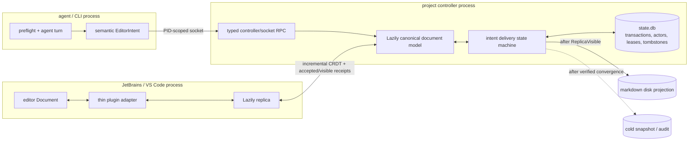
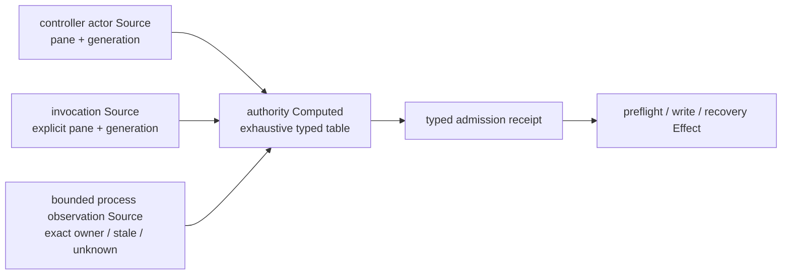
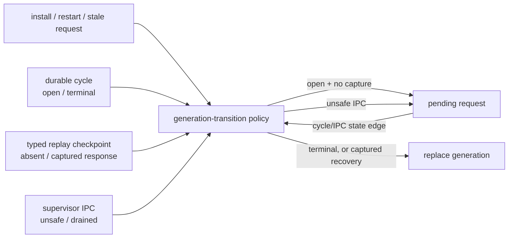

# Process topology and authority map

## Current topology

Lazily canonical text is the sole attached-document authority. The editor owns
operator-originated edits through its replica; the binary owns semantic agent
intents. Disk is a projection, and snapshots are cold recovery/audit output.
The only hot durable state is the transactional `state.db` ledger.

There is no live-buffer file, patch inbox, file IPC, file ACK, write-provenance
marker, controller bootstrap JSON, layout JSON, capture JSON, cycle JSON, or
CRDT file sidecar. The filesystem socket and OS lock files are synchronization
primitives, not state authorities.

## Delivery state machine

Every agent mutation advances monotonically:

`IntentCaptured -> CanonicalApplied -> ReplicaAccepted -> ReplicaVisible -> DiskProjected -> Committed`

A timeout retains the same transaction and resumes from the recorded phase.
Retries are idempotent. Terminal cycles cannot expose retained response history
as active work. An operator edit that changes the expected generation causes a
semantic rebase; an operator same-node edit or deletion wins.

## Pane execution authority

Pane identity is an admission fact, not ambient process state:

Controller-owned effects bind the document actor's pane explicitly; they never
inherit the controller host's `TMUX_PANE`. A live non-owner is rejected before
repair, lease acquisition, response capture, or cycle-open. A stale binding can
be superseded only by exact process-tree proof for the invoking document. Pane
string equality without that proof is insufficient, including for legacy
registry rows with no actor generation.

## Supervisor generation transition authority

Supervisor replacement is gated by durable document topology, not a scraped
prompt or an idle-watch timeout:

An ordinary open preflight has no replay checkpoint and therefore cannot cross
a supervisor generation boundary. Binary staleness and elapsed polling ticks
never weaken that edge. Captured-response recovery is the sole open-cycle
exception, and it still requires drained supervisor IPC.

## Removed race classes

| Race | Architectural resolution |
|---|---|
| Editor save versus binary disk fallback | Attached documents never use a behind-editor disk write. |
| ACK deadline versus UI latency | Accepted and visible receipts are separate typed phases; neither is inferred from a file. |
| Reconnect replay duplicates a boundary/response | Response cells and boundaries have semantic identities and normalize in Lazily before integrity validation. |
| Unsaved queue deletion is resurrected | Queue tombstones and exact generation CAS make deletion monotonic across replicas. |
| Finalize/write recovery loops | One transaction state machine chooses the only valid next transition; committed/abandoned captures are inactive. |
| Controller restart loses intent | Bootstrap, actor, delivery, and recovery state are transactional rows in `state.db`. |
| Editor tab focus is stolen | Background reconciliation never invokes focus/select APIs; explicit operator commands own focus changes. |
| Controller recovery inherits the host pane | Actor pane and generation feed one authority Computed; rejected admission has no mutation side effect. |
| Install/restart interrupts an open preflight | The generation-transition policy defers every uncaptured open cycle; no timeout can synthesize replay authority. |

## Plugin boundary

Plugins translate editor changes into incremental Lazily operations and apply
named `EditorIntent` variants from the binary. The Rust, Kotlin, and TypeScript
layers use the same intent and receipt names. Plugins do not own merge policy,
queue policy, lifecycle state, disk fallback, or recovery.

UI-thread callbacks may record a cheap generation/typing fact and enqueue work.
CRDT merge, socket IO, semantic diffing, document saves, and recovery run off
the UI thread. This keeps editor activity responsive even during controller
recycle or retained-intent replay.

## Recovery boundary

Cold recovery may retain a snapshot, forensic log, or `state.db` CRDT
checkpoint. Recovery material is regenerated after verified convergence and
cannot override Lazily current text. If recovery evidence conflicts with the
live model, the live model wins and the cold projection is repaired or
quarantined asynchronously.
