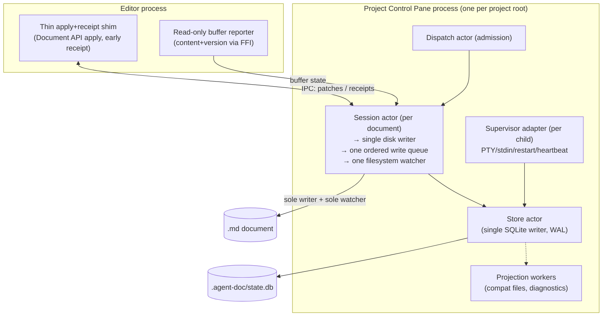

# Process topology & race-condition map

> Evergreen architecture map for agent-doc's document write/watch path. Keep this
> in sync as the single-process control-plane migration (`08b`,
> `tasks/agent-doc/plan-supervisor-in-process.md`) lands. Companion to
> [08b-single-process-control-plane.md](08b-single-process-control-plane.md).

## What runs where (today)

A live `/agent-doc` session for one document spans **three OS processes** that all
touch the same `.md` on disk, serialized only by an advisory `flock` + SQLite
compare-and-swap. That split is the structural root of the IPC-drift /
File-Cache-Conflict / supervisor self-race family (R1–R6).

```mermaid
flowchart TB
    subgraph EditorProc["Editor process (IntelliJ / VS Code)"]
        WS["Plugin WatchService\n(observes .md, saveDocument)"]
        PW["PatchWatcher / FFI socket client\n(applies patches via Document API)"]
        TT["TypingTracker\n(reports buffer digest+content via FFI #pcp6)"]
    end

    subgraph SupervisorProc["Supervisor process (agent-doc start --route-owned)"]
        SUP["Supervisor\n(harness child PTY/stdin, restart,\nreadiness, heartbeat)"]
        IDLE["idle-queue / file-watch writes"]
    end

    subgraph CliProc["agent-doc CLI process (finalize / write / stream / repair)"]
        FIN["finalize / run_stream\n→ atomic_write (disk)"]
        GUARD["guard_visible_write_reconcile\nlive_buffer_diverges_from_content"]
    end

    subgraph Controller["Project controller state (in CLI/start process today)"]
        DB[("`.agent-doc/state.db`\nactor records, cycles, leases")]
        SA["session_actor.rs\n(data struct + SQLite CAS,\nNOT a message actor yet)"]
    end

    DOC[(".md document on disk")]
    SIDE[(".agent-doc/ sidecars\nlive-buffer, write-provenance,\npatches, snapshots, cycles")]

    WS -->|observes / saveDocument| DOC
    FIN -->|atomic_write| DOC
    IDLE -->|disk write| DOC
    TT -->|digest+content| SIDE
    GUARD -->|reads| SIDE
    FIN -->|stamps write-provenance #pcp2\n(shared recorder: write.rs + run.rs atomic_write)| SIDE
    IDLE -->|stamps write-provenance #pcp2| SIDE
    PW <-->|FFI socket / file IPC patches| FIN
    SA --> DB
    SUP --> DB

    DOC -. "two writers (WS+FIN+IDLE)\n→ R1 / File Cache Conflict" .-> WS
    FIN -. "route drain vs concurrent finalize\n→ R6 / exit 75" .-> SUP
```

## The R1–R6 races and their fixes

| # | Race | Root | Fix |
|---|------|------|-----|
| R1 | Two file-watchers / two writers (plugin WatchService + binary disk fallback) → File Cache Conflict | separate processes, no single writer | `#pcpc4` single controller-owned watcher + `#pcp7` demote WatchService to read-only |
| R2 | EDT/save lag vs receipt budget → false receipt-timeout / degrade vote | apply latency coupled to sender liveness | `#pcp5` early receipt IPC (`#ipc-receipt-timeout-align`/`#ipc-degrade-false-vote` partial): listener emits an `accepted` receipt on patch receipt (before apply) when the sender opts in with `early_receipt`; `send_message` skips it and waits for the terminal `applied`/`rejected` receipt (liveness-only, never a false success). **Activated `#saevon` (2026-06-09):** the sender auto-tags live closeout `patch` messages, so the accepted receipt fires before the blocking apply on every closeout. A successful early-receipt emit logs `[ipc-socket] early receipt accepted emitted before apply` and the `early_receipt_accepted` ops marker; live verification (`#xkpf` / `#lvb-run`) greps that marker with a paired terminal receipt and no `receipt_timeout` / `false_success`. Legacy ACK-only listener responses are rejected as incompatible plugin/native-library versions. |
| R3 | Disk fallback manufactures the foreign write IntelliJ flags as a cache conflict when degraded | raw disk write on degrade | **`#ipc-degraded-prefers-file-ipc` ✅** (degraded socket routes through the file-IPC patch queue; plugin applies via Document API; unproven file IPC fails closed for retry) |
| R4 | mtime-heuristic drift: `live_buffer_diverges_from_content` infers foreign-vs-unsaved from `LIVE_BUFFER_STALE_SKEW_MS` only → real edit fails closed | no provenance / no buffer content | **`#pcp2` write-provenance ✅** + **`#pcp6` editor-buffer content ✅** (fixed) |
| R5 | TOCTOU between FFI socket handler and WatchService for the same patch | two appliers | `#pcp7` thin apply+receipt shim |
| R6 | Supervisor self-race: route-owned supervisor races the agent's own finalize → "could not drain the active closeout" / exit 75 | separate-process writers, no in-process queue | **`#pcp3a` drain race-hardening ✅** (mitigation) + `#pcpc3` in-process write queue (root) |

## Can the Plugin IPC move into the Project Control Pane process?

Partly, and that is the target. The plugin must stay in the **editor process** (it
needs the IntelliJ/VS Code Document API + EDT to apply patches and read the buffer)
— it cannot move into the controller. What *does* move into the controller process
(`08b` §"In-process actors") is the **write/watch authority**: the supervisor
becomes an in-process adapter, the session actor becomes a real message actor
owning one ordered write queue + one filesystem watcher, and the plugin is demoted
to a **thin read-only reporter + apply/receipt shim** (no autonomous reconcile, no disk
write). IPC remains the editor↔controller boundary; what changes is that only one
authority (the controller's session actor) writes disk and watches the file, so the
two-writers/two-watchers races (R1/R5) and the supervisor self-race (R6) cannot
occur. IPC lag does not reintroduce a race because the editor stops being an
independent writer — it reports buffer state and applies controller-authored
patches, and the controller serializes everything through the write queue.

## Target topology (after `#pcpc1`–`#pcpc5`)


