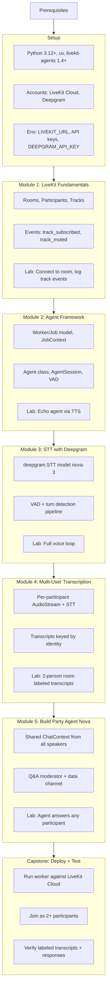

# Build Party — Miguel's LiveKit Agent Course

```mermaid
graph TD
    PRE["Prerequisites"]
    subgraph PRE_ITEMS["Setup"]
        P1["Python 3.12+, uv, livekit-agents 1.4+"]
        P2["Accounts: LiveKit Cloud, Deepgram"]
        P3["Env: LIVEKIT_URL, API keys, DEEPGRAM_API_KEY"]
    end
    subgraph MOD1["Module 1: LiveKit Fundamentals"]
        M1A["Rooms, Participants, Tracks"]
        M1B["Events: track_subscribed, track_muted"]
        M1C["Lab: Connect to room, log track events"]
    end
    subgraph MOD2["Module 2: Agent Framework"]
        M2A["Worker/Job model, JobContext"]
        M2B["Agent class, AgentSession, VAD"]
        M2C["Lab: Echo agent via TTS"]
    end
    subgraph MOD3["Module 3: STT with Deepgram"]
        M3A["deepgram.STT model nova-3"]
        M3B["VAD + turn detection pipeline"]
        M3C["Lab: Full voice loop"]
    end
    subgraph MOD4["Module 4: Multi-User Transcription"]
        M4A["Per-participant AudioStream + STT"]
        M4B["Transcripts keyed by identity"]
        M4C["Lab: 2-person room labeled transcripts"]
    end
    subgraph MOD5["Module 5: Build Party Agent Nova"]
        M5A["Shared ChatContext from all speakers"]
        M5B["Q&A moderator + data channel"]
        M5C["Lab: Agent answers any participant"]
    end
    subgraph CAP["Capstone: Deploy + Test"]
        C1["Run worker against LiveKit Cloud"]
        C2["Join as 2+ participants"]
        C3["Verify labeled transcripts + responses"]
    end
    PRE --> PRE_ITEMS --> MOD1 --> MOD2 --> MOD3 --> MOD4 --> MOD5 --> CAP
```
